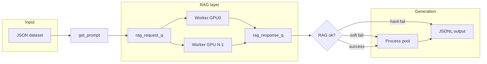

# MIRAGE-RAG — End-to-end pipeline guide

This document describes how data moves through the project: from offline preparation of the vector database and optional crop dictionary, through batch RAG inference and answer generation. It is aligned with the six in-repo Markdown references in **Section 8.2** and with the current implementation in `rag_agent/`, `preload_pipeline/`, and `Inference/`.

---

## 1. Introduction and repository map

### 1.1 What this system does

MIRAGE-RAG is built around a **retrieval-augmented** workflow backed by a **persistent Chroma** vector store. Documents are chunked, embedded, and stored with metadata (including location and hardiness zone where applicable). At query time, an LLM-driven **RAG agent** retrieves evidence, evaluates confidence, and may search the web and ingest new pages when confidence is low.

**Batch inference** (`Inference/generate.py`) runs many items through that RAG stack and then a separate **generation** step, using a multi-process, GPU-aware layout so RAG load is controlled and scalable.

**Offline ingestion** (`preload_pipeline/bootstrap.py`) fills or refreshes the same Chroma database using a **manifest** so seeding is repeatable and auditable.

### 1.2 Main directories

| Path | Role |
|------|------|
| `rag_agent/` | Chroma client, embeddings, chunking utilities, tools (retrieve, confidence, web search, web/PDF ingestion, keywords), and `MainAgent` (Google ADK `LlmAgent` + `InMemoryRunner`). |
| `preload_pipeline/` | Manifest-driven preload: lock, backup, adapters (CSV, web list, PDF dir), JSON run report. |
| `Inference/` | `generate.py`: dataset → RAG queue → per-GPU workers → generation pool → JSONL output. Optional crop **query enrichment** before RAG. |
| `chat_models/` | Clients used by generation (and related chat flows). |
| `Datasets/` | Reference data (e.g. land-grant universities for URL-derived location). |

Run batch jobs from the `Inference/` directory (or ensure the process working directory matches where `MainAgent` expects its Chroma path—see [§2.1](#21-chroma-persistence-and-collection-name)).

### 1.3 How to read this guide

- **Sections 2–4** cover shared concepts, **preload** (vector DB), and the **crop dictionary** (query enrichment only—not stored in Chroma).
- **Sections 5–6** cover **batch inference** and **runtime RAG agent** behavior.
- **Section 7** is an operational checklist (cluster jobs, pre-run checks, monitoring, environment setup); **Section 8** lists primary files and doc references.
- **§3.8** and **§4.5** collect **working-directory-specific** commands for the vector DB and crop dictionary; **§5.8** covers local LLM servers.

---

## 2. Core concepts and shared artifacts

### 2.1 Chroma persistence and collection name

- The RAG stack uses **Chroma** with a named collection. The default collection name in code is **`meta-mirage_collection`** (see `rag_agent/main.py` and preload `--collection`).
- `MainAgent` constructs `chromadb.PersistentClient(path=...)` pointing at a **directory** on disk (default in code: `./chroma_database/chroma_db` relative to the **current working directory** of the process). Preload should write to the **same** persistence path your inference jobs use, or you must copy the entire persistence directory to that location before running `generate.py`.
- **Embedding model** must match between preload and runtime: default in both `bootstrap.py` and `Generate` is **`BAAI/bge-base-en-v1.5`** (`--embed-model` / `--embed_model_name`).
- **Device** for the sentence-transformer embedder should match (`--device` / `device`, often `"None"` for auto).

### 2.2 Two different artifacts: vector DB vs crop dictionary

| Artifact | Purpose | Consumed by |
|----------|---------|-------------|
| **Chroma DB** (chunks + embeddings) | Retrieval for agricultural/extension content | `MainAgent` retrieve / confidence / optional web ingest |
| **Crop dictionary JSON** | Optional **query enrichment** only: may insert crop names into the user question when the query implies a crop but does not name it | `CropQueryEnricher` in `rag_agent/crop_query_enrichment.py`, called from `Inference/generate.py` |

The crop dictionary does **not** replace or duplicate the vector store; it only rewrites the **text** of the user message (with strict rules) before RAG runs.

### 2.3 Metadata — policy, storage, retrieval, and search

Project policy (see `preload_pipeline/docs/README.md`) includes:

- **`location`**: Used to derive **`hardiness_zone`** via `rag_agent.utils.metadata` helpers. Preferred forms: **`"State"`** or **`"State, County"`** (full state name or two-letter abbreviation).
- **`hardiness_zone`**: Expected when `location` resolves; may be empty if lookup cannot resolve.
- **`month_year`**: For **preload** web/PDF sources, provide **`YYYY-MM`** in the manifest when you want consistent dating. CSV ingestion may leave `month_year` empty by design. Runtime web-search ingestion derives/validates `month_year` from search/page metadata per `rag_agent` tools.

Preload **manifest validation** (`preload_pipeline/preload/config.py`) enforces:

- **CSV**: each source must have **`location`** or **`location_field`** (for per-row location).
- **`web_page_list` and `pdf_dir`**: each source must have **`location`** (for hardiness derivation).

#### 2.3.1 Canonical metadata stored on each chunk

Ingestion paths (web, PDF, CSV preload) ultimately attach metadata through `rag_agent.utils.metadata.build_canonical_chunk_metadata`. Typical **canonical keys** on each Chroma document include:

| Field | Role |
|------|------|
| `source_type` | Origin class (e.g. web, pdf, csv) for provenance and debugging. |
| `source_id` | Stable identifier for the source record or URL slug. |
| `title` | Page or document title; used in **progressive retrieval** when the agent passes a `title` filter and in confidence **scope** scoring. |
| `url` | Source URL or synthetic identifier; provenance and dedupe context. |
| `page` | Page index within a PDF or logical page. |
| `chunk_index` | Which token chunk within the page/record. |
| `location` | Geographic scope you asserted at ingest time (`State` or `State, County`); drives **hardiness_zone** derivation when not passed explicitly. |
| `month_year` | Publication or snapshot month **`YYYY-MM`** when known; enables time-scoped retrieval filters. |
| `content_hash` | Hash of normalized chunk text; used to **skip duplicate** chunks on re-ingestion. |
| `language` | Document language tag when detected or defaulted. |
| `hardiness_zone` | USDA-style zone string derived from **`location`** via `extract_hardiness_zone_for_location` (and county/state datasets); **required for location-aware filtering** when the lookup succeeds. |

Extra keys may be merged via `extra_metadata` on some paths (e.g. CSV tags). Empty or unknown values are often stored as sentinel placeholders in tools (`__null__` / `-1` patterns in `MainAgent`), while retrieval treats strings like `NULL`, `N/A` as missing when filtering.

**Why `location` is required at preload manifest level:** without a resolvable location, `hardiness_zone` may be empty, weakening metadata filters and making extension-style retrieval less precise.

#### 2.3.2 How query-time inputs map to filters

`retrieve_content` / `_tracked_retrieve_content` pass optional **`location`**, **`month_year`**, and **`title`** into `ContentUtils.retrieve_with_priority_filters`. The **`location` string is not matched directly** on chunks for filtering; it is normalized and used only to **derive `hardiness_zone`** (see comment in `ContentUtils.py`). Batch inference sets `MainAgent.current_location` from the dataset so the effective location matches the user’s state/county when the model omits an explicit location argument.

#### 2.3.3 Eligible candidate filters (the “priority ladder”)

`ContentUtils.retrieve_with_priority_filters` builds a **list of candidate strategies** (`filter_attempts`). Each entry is a `(strategy_name, where_filter)` pair. A strategy is **only added** if every metadata field it needs is present after cleaning (see §2.3.2): e.g. `hardiness_zone+month_year+title` is skipped unless **`hardiness_zone`**, **`month_year`**, and **`title`** are all non-empty.

The **append order** encodes design intent (prefer combinations that tie chunks to place, time, and document identity when data exists):

1. `hardiness_zone` + `month_year` + `title`
2. `hardiness_zone` + `title`
3. `title` alone
4. `month_year` alone
5. `hardiness_zone` + `month_year`
6. `hardiness_zone` alone
7. **`semantic_only`** — `where` is omitted; pure embedding similarity over the full collection.

If the query supplies no usable `title`/`month_year`/derived `hardiness_zone`, several combined strategies never appear, and the list may reduce to **`month_year`**, **`hardiness_zone`**, and/or **`semantic_only`** depending on what remains. That is why consistent ingest metadata improves precision when the user’s region and time are known.

**Important:** this ladder is **not** “first strategy that returns enough hits wins.” See §2.3.4.

#### 2.3.4 Priority retrieval: evaluation loop, similarity formula, and winner selection

Implementation reference: `rag_agent/utils/ContentUtils.py` — `retrieve_with_priority_filters`.

**Concept.** *Priority retrieval* means: for one user query, run **one Chroma `collection.query` per candidate strategy** (each with the same embedding and `n_results=k`, default 5). Every strategy that returns at least **`min_results`** hits (default 1) is **valid**. Among valid strategies, the implementation picks the one with the **highest normalized similarity score** (not the first in the list). So a broader filter can win if its top-\(k\) hits are semantically stronger than a stricter filter’s hits.

**Per-hit similarity (distance to score).** Chroma returns distances where **lower is better**. For each hit \(i\) with distance \(d_i \ge 0\), the code converts to a **higher-is-better** similarity in \((0, 1]\):

\[
s_i = \frac{1}{1 + \max(d_i,\,0)}
\]

**Strategy score (normalized score for one candidate).** Let \(n\) be the number of documents returned for that query (up to \(k\)). The strategy’s aggregate score is the **mean** of per-hit similarities:

\[
\text{normalized\_score} = \frac{1}{n} \sum_{i=1}^{n} s_i \quad (\text{or } 0 \text{ if } n = 0)
\]

**Winner selection.**

1. Evaluate **all** candidates in `filter_attempts` (including `semantic_only`).
2. **Valid** strategies are those with `doc_count >= min_results`.
3. If any valid strategy exists, choose  
   `best_strategy = argmax normalized_score`  
   over valid strategies, breaking ties by Python’s `max` ordering on the list (deterministic given fixed evaluation order).
4. Return the **`where` clause**, **strategy name**, and **formatted hit list** from that winner. If none are valid, return `("no_results", [])` with no filter.

**Parameters.**

| Parameter | Role |
|-----------|------|
| `k` | Top-\(k\) hits per strategy (`n_results` in Chroma). |
| `min_results` | Minimum `doc_count` for a strategy to participate in the max-score selection (default 1). |

**Why this design.** Stricter metadata filters shrink the corpus; if that subset has weak embedding matches, a **looser** filter (or `semantic_only`) can still win on **average similarity**, keeping retrieval grounded in vector relevance while using metadata when it helps.

#### 2.3.5 Confidence scoring and metadata “scope”

`ConfidenceEvaluator.evaluate_retrieval_confidence` calls the same **`retrieve_with_priority_filters`** path, then applies a **separate** confidence model: similarity, coverage, consistency, and a **scope weight** tied to which **strategy name** won in §2.3.4. Higher weights apply when stricter filters win (e.g. `hardiness_zone+month_year+title` vs `semantic_only`). See `scope_weights` in `rag_agent/tools/confidence_evaluator.py` for the exact mapping. That means **better metadata alignment** (zone + month + title) both influences which chunks win priority retrieval and tends to raise **confidence_level**, reducing unnecessary web search.

#### 2.3.6 Web search and metadata (`WebSearch`)

`WebSearch.web_search` accepts **`use_domain_filter`** (default `True`). When this flag is `True`, and **`location`** is provided, `get_filtered_edu_domains_for_search` uses **state-linked** and **hardiness-zone-linked** `.edu` domains from `Datasets/land_grant_universities.csv` and `Datasets/hardiness_zone_edu_domain.csv` to restrict or prioritize extension/university sources. When `use_domain_filter` is `False`, web search runs as an open query (no `.edu` site-clause restriction). In `MainAgent`, `_tracked_web_search` supports an optional per-call override and otherwise uses the code-controlled class setting `self.use_domain_filter` for run-level ablations. Results carry **`month_year`** derived from `page_age` (or validated provider fields) for downstream **`_tracked_add_web_content`** so ingestion stays consistent with retrieval policies.

#### 2.3.7 Runtime vs preload responsibilities

| Stage | Who sets `location` / zone / `month_year` |
|------|-------------------------------------------|
| Preload manifest | You set `location` (and usually `month_year` for web/PDF); tools compute `hardiness_zone` at chunk write time. |
| Runtime web ingest | Search tool + `WebAddition` set `month_year` and often derive location from `.edu` domains when not explicitly given. |
| Batch `generate.py` | `get_prompt` builds `[User location: …]`; worker sets `current_location` for tools. |

### 2.4 Shared ingestion behavior (preload vs runtime)

Preload reuses `rag_agent` components so offline and online ingestion stay consistent:

- **Embeddings**: `SentenceTransformerEmbeddingFunction`
- **Chunking / hashing**: `ContentUtils.chunk_by_tokens`, `compute_content_hash`, `content_hash_exists`
- **Web**: `WebAddition.add_web_content`
- **PDF**: `PDFAddition.add_pdf_content`

CSV rows are turned into narrative text inside the preload adapter, then passed through the same chunking and deduplication path.

---

## 3. Offline pipeline A — Building the vector database (preload)

### 3.1 Stage 0 — Lock and backup

- A **file lock** is acquired at **`<persist_dir_parent>/.preload_lock`** so two preload runs do not corrupt the same database concurrently.
- If the persistence directory already exists, it is **copied** to a timestamped folder under **`backups/`** (default: `<persist_dir_parent>/backups/<timestamp>_before_preload/`), with optional pruning of old backups (`--keep-last`, default 20).
- If the persist dir does not exist, it is created.

**Assumptions:** You have disk space for a full copy; you run preload when no other process is writing the same Chroma path.

### 3.2 Stage 1 — Manifest loading

- The manifest is a YAML file with a top-level **`sources:`** list (non-empty). Each entry must include **`name`** and **`type`**.
- Supported types: **`csv`**, **`web_page_list`**, **`pdf_dir`** (see `preload_pipeline/bootstrap.py`).
- Validation rules for location are in [§2.3](#23-metadata-conventions-location-hardiness-monthyear).

Example patterns appear in `preload_pipeline/docs/manifest.example.yaml`.

### 3.3 Stage 2 — Integration with `rag_agent`

`preload_pipeline/preload/rag_agent_integration.py` builds:

- `chromadb.PersistentClient(path=<persist_dir>)`
- `get_or_create_collection(name=<collection>, embedding_function=...)`
- `ContentUtils`, `WebAddition`, `PDFAddition`

With `--dry-run`, writes to the collection are suppressed via a shim that still exercises logic but logs “would add” instead of persisting chunks.

### 3.4 Stage 3 — Source adapters

#### 3.4.1 `web_page_list`

- **Requires** `urls` (non-empty list).
- Passes **`location`** and **`month_year`** from the manifest into `WebAddition.add_web_content(url=..., location=..., month_year=...)`.
- Success/failure is tracked per URL; chunks added and duplicate skips are aggregated from the tool response.

#### 3.4.2 `pdf_dir`

- Iterates PDFs under the configured directory and calls **`PDFAddition.add_pdf_content`** with the same metadata pattern as web sources.

#### 3.4.3 `csv`

- Implements **row → structured narrative → chunk → dedupe → `collection.add`**, using `ContentUtils` and hash checks like web/PDF.
- Optional **`id_field`** maps a CSV column to stable record IDs.
- Rows that cannot resolve location (per adapter rules) are treated as failures so metadata stays reliable.

### 3.5 Stage 4 — Run report

After all sources finish, a JSON report is written next to the persistence parent:

- **Filename pattern:** `preload_run_report_<YYYY-MM-DD_HHMMSS>.json`
- **Location:** `out_dir = persist_dir.parent` (see `preload_pipeline/preload/pipeline/report.py`)

The report includes manifest path, persist dir, collection name, timestamps, optional backup path, per-source success/failure counts, and item-level processed/added/skipped/failed totals.

### 3.6 Helper: generating `web_page_list` YAML from names

For many URLs sharing one base path and metadata, use the flow documented in `preload_pipeline/Ingestion/URLs/scripts/generate_web_sources.md`:

- Inputs: **`--base-url`** and exactly one of **`--names-file`** (one name per line) or **`--urls-file`** (one full URL per line), plus optional **`--output`**, **`--location`**, **`--entity-type`**, **`--source-org`**, repeatable **`--tag`**, etc.
- In names mode, names are normalized to URL slugs; in URL mode, full URLs are preserved and source names are derived using the `--base-url` context.

### 3.7 How to run preload

From `preload_pipeline/` (or with adjusted paths):

```text
pip install -r requirements.txt
python bootstrap.py \
  --manifest manifest.yaml \
  --persist-dir ../rag_agent/chroma_database/chroma_db \
  --collection meta-mirage_collection \
  --rag-agent-dir ../rag_agent
```

Important flags:

| Flag | Meaning |
|------|--------|
| `--manifest` | Path to YAML |
| `--persist-dir` | Chroma persistence **directory** (not a single file) |
| `--collection` | Must match runtime (`meta-mirage_collection` by default in `MainAgent`) |
| `--rag-agent-dir` | Directory containing the `rag_agent` package |
| `--embed-model` | Must match `rag_agent` / `generate.py` |
| `--device` | Must match embedding runtime |
| `--dry-run` | Exercise pipeline without writing chunks |

**Recommended workflow:** stop anything using the DB → run preload → inspect `preload_run_report_*.json` → restart consumers.

**Requirements summary:** matching embed model, device, collection name, and persist path; for web/PDF sources, manifest **`location`**; copy the **entire** Chroma folder when moving machines—do not copy only SQLite files in isolation.

### 3.8 Building the vector database — working directory and example commands

**Always run `bootstrap.py` and preload-related commands from the `preload_pipeline/` directory** so relative paths in manifests and scripts match the layout described in `preload_pipeline/docs/README.md`.

#### If ingesting URL lists (generate manifest sources, then preload)

1. Generate manifest-ready `web_page_list` YAML from either a names file or a full URLs file (example paths below are relative to **`preload_pipeline/`**):

```bash
python Ingestion/URLs/scripts/generate_web_sources.py \
  --base-url "https://extension.illinois.edu/plant-problems/" \
  --names-file "Ingestion/URLs/names/uiuc.txt" \
  --location "Illinois" \
  --entity-type "disease" \
  --source-org "Illinois Extension" \
  --output "Ingestion/URLs/Outputs/uiuc_generated_sources.yaml"
```

Alternative URL-file mode:

```bash
python Ingestion/URLs/scripts/generate_web_sources.py \
  --base-url "https://extension.illinois.edu/plant-problems/" \
  --urls-file "Ingestion/URLs/names/uiuc_urls.txt" \
  --location "Illinois" \
  --entity-type "disease" \
  --source-org "Illinois Extension" \
  --output "Ingestion/URLs/Outputs/uiuc_generated_sources.yaml"
```

2. Run the preload pipeline against that manifest (still from **`preload_pipeline/`**). Use the same YAML path you passed to `--output` in step 1:

```bash
python bootstrap.py \
  --manifest Ingestion/URLs/Outputs/uiuc_generated_sources.yaml \
  --persist-dir ./chroma_database_src/chroma_db \
  --collection meta-mirage_collection \
  --rag-agent-dir ../rag_agent
```

Adjust `--manifest`, `--persist-dir`, and `--rag-agent-dir` to your actual files and output locations. If you copy or save the generated YAML under `Ingestion/URLs/YAMLfiles/` instead (as in `preload_pipeline/docs/README.md`), set `--manifest` to that path consistently.

#### If ingesting PDFs only

Prepare a manifest (for example under `Ingestion/PDFs/YAMLfiles/`) and run (from **`preload_pipeline/`**):

```bash
python bootstrap.py \
  --manifest Ingestion/PDFs/YAMLfiles/uiuc_batches.yaml \
  --persist-dir ./chroma_database_src/chroma_db \
  --collection meta-mirage_collection \
  --rag-agent-dir ../rag_agent
```

---

## 4. Offline pipeline B — Crop dictionary for query enrichment

### 4.1 Purpose

Some user questions refer to **category-level** crop information (pests, diseases, fields in a structured crop record) **without naming the crop**. Optional **query enrichment** uses a **JSON crop dictionary** (organized by state) and a **single LLM call** to insert **allowed** crop names into the **question body only**, then recombine with an unchanged **`[User location: …]`** prefix. Details: `preload_pipeline/Dict-Value-Database/QUERY_ENRICHMENT_CONTEXT.md`.

### 4.2 Building the dictionary

- The authoritative build scripts live under `preload_pipeline/Dict-Value-Database/scripts/` (e.g. **`build_crop_dictionary.py`**).
- YAML **`url_batches`** for that pipeline can be produced with `preload_pipeline/Dict-Value-Database/scripts/generate_web_sources.py` (see `preload_pipeline/Dict-Value-Database/scripts/generate_web_sources.md`): **`--base-url`**, **`--names-file`**, **`--state`**, **`--category`**, **`--output`**, optional **`--url-style`**.

### 4.3 Runtime placement and CLI (`Inference/`)

- Default: place **`CropDatabase.json`** in the same directory as `Inference/generate.py`, or pass **`--crop_dictionary_path`** (relative paths resolve against `Inference/`).
- **`--disable_query_enrichment`**: turns enrichment off even if a file path is set.
- Empty **`--crop_dictionary_path`** (`""`) disables enrichment.

If the file is missing, `Generate` logs and runs with enrichment effectively off.

### 4.4 Implementation behavior (`rag_agent/crop_query_enrichment.py`)

- **Not** dependent on Chroma or ADK; uses the OpenAI-compatible client against the **same `api_base` and model** as that RAG worker.
- Splits the full user string into **`prefix`** (optional `[User location: …]\n\n`) and **`body`** via regex.
- If enrichment is enabled and a dictionary is loaded, the worker passes a **state slice** of the JSON (matching the state from the location line) plus an **allowlist** of crop names into one chat completion.
- **Fallback:** on any failure (missing state in dict, empty list, serialize error, LLM error, bad JSON, or model output that is not a pure **insertion** supersequence of the original body), **`enrich()` returns the original full query unchanged**.
- Dictionary size is capped for prompting (`_MAX_DICT_JSON_CHARS`); allowlist text may truncate with a note.

### 4.5 Creating the crop database for query enrichment — working directory and commands

**Run the Dict–Value–Database scripts from `preload_pipeline/Dict-Value-Database/`** (the project’s “Dict-Value Database” directory—not the repo root) so relative paths such as `../Datasets/...` resolve as in `preload_pipeline/docs/README.md`.

Example sequence:

```bash
cd preload_pipeline/Dict-Value-Database

python scripts/generate_web_sources.py \
  --base-url "https://extension.illinois.edu/plant-problems/" \
  --names-file "../Ingestion/URLs/names/uiuc.txt" \
  --state "Illinois" \
  --category "disease" \
  --output "YAMLfilesForDict/uiuc.yaml"

python scripts/build_crop_dictionary.py \
  --config YAMLfilesForDict/uiuc.yaml \
  --csv ../../Datasets/county_crops_frequency_multi_year_cleaned.csv \
  --output output/crop_dictionary_output.json
```

Here `../Ingestion/...` reaches `preload_pipeline/Ingestion/...`, and `../../Datasets/...` reaches the repo-root `Datasets/` CSV. If your checkout layout differs, use absolute paths. Copy or symlink the built JSON to `Inference/CropDatabase.json` (or pass `--crop_dictionary_path`) for batch runs.

---

## 5. Runtime pipeline — Batch inference (`Inference/generate.py`)

### 5.1 End-to-end data flow

1. Load JSON dataset from **`--input_file`**.
2. Skip items already successfully written to **`--output_file`** (JSONL) for the chosen answer model key.
3. Build a **multiprocessing** context with **`spawn`**.
4. Detect **GPU count** (`torch.cuda.device_count()`); if zero, treat as **one** logical GPU.
5. Build one OpenAI-compatible **endpoint per GPU**: `http://<host>:<11434 + i>/v1` unless `--openai_api_base` supplies a host/scheme (see `_build_endpoints`).
6. Create **`rag_request_q`** (bounded by `num_gpus * rag_inflight_per_gpu`, default inflight 2 per GPU) and **`rag_response_q`**.
7. Start **rank-0** RAG worker first; wait until it signals **READY** on **`rag_status_q`** (timeout 300s). If rank0 fails, abort.
8. Start remaining RAG workers; wait until all **READY**.
9. For each item, **`get_prompt`** builds `prompt["user"]` (optional `[User location: state, county]\n\n` + question), **`images`**, and **`location`**.
10. The run-level **`ablation_id`** is provided by `Inference/bash_generate.sh` (`ABLATION_ID`) to `Inference/generate.py` (`--ablation_id`) and forwarded into each `MainAgent` instance.
11. Workers dequeue `(item_id, prompt["user"], location, attempt)`, set **`current_location`**, run **`CropQueryEnricher.enrich`** → **`effective_query`**, then **`run_debug(effective_query, session_id=...)`**.
12. Inside `MainAgent`, the agent resolves `ablation_id` against `rag_agent/ablation_configs.json`, applies toggles, builds the tool list from toggles, and resolves the instruction template key.
13. Main process receives **`(item_id, rag_answer, error, web_search_flag, endpoint, attempt, effective_query)`**.
14. On **successful** RAG (not soft failure), build  
    **`enhanced = effective_query + "\n\nadditional context: " + rag_answer`**  
    and dispatch **`generation_worker`** with that string.
15. On **soft** RAG failure, **`enhanced = effective_query`** (no context block), generation still runs.
16. On **hard** RAG failure, optional **retry** up to **`max_rag_attempts`** (2); else write item with hard-fail status and **skip generation**.

### 5.2 GPU endpoints and scaling

- Each worker binds to **`api_base`** for the LLM (RAG agent + enrichment both use that base URL).
- Port numbering starts at **11434** and increments by one per GPU when using default host.

### 5.3 Rank0 barrier and Chroma collection reset

Only **rank0** starts with **`do_reset_collection=True`**, calling **`MainAgent.reset_collection()`** once so the collection is dropped and recreated cleanly.

Other workers start with **`do_reset_collection=False`** and explicitly **`get_or_create_collection`** after startup so they bind to the **current** collection ID.

**Why:** Chroma collections have internal IDs; deleting a collection from one process leaves **stale handles** in others. Starting non-rank0 workers only after rank0 is **READY** avoids “collection does not exist” errors from old UUIDs.

### 5.4 Self-healing retrieval

If **`_tracked_retrieve_content`** catches an error whose message indicates the collection **does not exist**, `MainAgent` **rebinds** the collection and dependent tools (`PDFAddition`, `WebAddition`, `ConfidenceEvaluator`) and **retries once**. This matches the behavior described in `Documentation.md`.

### 5.5 RAG failure classification

- **`_is_hard_rag_failure`**: connection/timeouts/5xx/“exception” style errors → retry then hard fail.
- **`_is_soft_rag_failure`**: short or empty answers, or non-hard errors → fallback to **`effective_query`** without RAG context, still generate.

### 5.6 Other notable parameters

- **`max_retries` / `retry_delay`**: generation retries per item (defaults 5 / 5s).
- RAG workers periodically **re-instantiate** `MainAgent` every **1000** requests to limit drift (see `RESTART_INTERVAL` in `generate.py`).

### 5.7 Diagram (batch path)



### 5.8 Serving LLM backends (OpenAI-compatible API)

Batch inference and the RAG agent expect an **OpenAI-compatible** HTTP API (for example **`http://127.0.0.1:11434/v1`** for the first GPU). **`Inference/generate.py`** builds endpoints starting at port **11434** and increments by one per detected GPU.

**Run these commands from the repository root** so paths like `./chat_template.jinja` resolve correctly for vLLM.

#### SGLang (example: bind to one CUDA device)

CUDA device indices start at **0**. To dedicate **GPU 0** to the server on port 11434:

```bash
CUDA_VISIBLE_DEVICES=0 python -m sglang.launch_server \
  --model-path meta-llama/Llama-3.2-11B-Vision-Instruct \
  --host 127.0.0.1 \
  --port 11434 \
  --tensor-parallel-size 1 \
  --tool-call-parser llama3 \
  --enable-multimodal \
  --trust-remote-code \
  --mem-fraction-static 0.9 \
  --max-total-tokens 32768
```

Use `CUDA_VISIBLE_DEVICES=1`, port **11435**, and so on, for additional GPUs to match `generate.py`’s endpoint list.

#### vLLM (vision-language / tool-calling example)

```bash
python -m vllm.entrypoints.openai.api_server \
  --model Qwen/Qwen2.5-VL-7B-Instruct \
  --host 127.0.0.1 \
  --port 11434 \
  --tensor-parallel-size 1 \
  --enable-auto-tool-choice \
  --tool-call-parser hermes \
  --chat-template ./chat_template.jinja
```

Model IDs, ports, and templates should match your deployment; align **`--test_model` / `--model_name`** in `generate.py` with the served model name.

---

## 6. Runtime pipeline — RAG agent behavior (`rag_agent`)

### 6.1 Agent contract (tools-first)

`MainAgent.main()` configures an **`LlmAgent`** (“Rag_Agent”) whose instructions require **function calling** (no fake tool outputs in plain text).  

Runtime behavior is now **ablation-driven**:

- `ablation_id` is resolved in `MainAgent` against `rag_agent/ablation_configs.json`.
- Resolved settings assign toggles (`use_progressive_filtering`, `use_confidence_eval`, `use_web_search`, `use_domain_filter`, `use_ingestion_loop`).
- Tool exposure is then gated from toggles (retrieve always available; confidence/web/ingestion tools only when corresponding toggles are enabled).
- Instruction template selection first tries `templates[ablation_id]` in `rag_agent/model_instructions.md`; if missing, fallback is `fallback_ablation`.

Because of this, the exact tool-call sequence is **template-dependent per ablation**, not a single fixed path for all runs.

### 6.2 Location handling

- User messages may begin with **`[User location: X]`**; that string is passed through to retrieve and web search as required by the agent instructions.
- **`_tracked_add_web_content`** does not take a user-supplied location in the same way; location for `.edu` URLs can be **derived** from the institution’s state (see metadata policy in `preload_pipeline/docs/README.md` and `Datasets/land_grant_universities.csv`).

### 6.3 Assumptions for RAG

- An **OpenAI-compatible** server is reachable at **`api_base`** for the tool-calling model.
- **Chroma** is populated and paths/collection match the running process.
- **Embedding model** and tokenizer settings align with how chunks were ingested.

---

## 7. Operational checklist

### 7.1 Before preload

- Install **`preload_pipeline/requirements.txt`**.
- Prepare **`manifest.yaml`** with valid `sources` and required **location** fields.
- Ensure enough disk for **backup +** new chunks.
- **Stop** any service or batch job using the target **`--persist-dir`**.

### 7.2 Before batch inference (`generate.py`)

- Start one **LLM server per GPU** on the expected ports (or configure **`--openai_api_base`** host consistently with `_build_endpoints`).
- Align **Chroma path** with `MainAgent` (run from the directory where `./chroma_database/chroma_db` is correct, or adjust code/deploy layout accordingly).
- Match **`--embed_model_name`** and **`--device`** to how the DB was built.
- Set run-level ablation in `Inference/bash_generate.sh` via **`ABLATION_ID`** (forwarded as `--ablation_id`).
- Confirm the selected `ABLATION_ID` exists in `rag_agent/ablation_configs.json` (currently documented IDs: 2,3,4,5,7,8).
- Confirm `rag_agent/model_instructions.md` has a matching `<!-- instruction:<ablation_id> -->` section (or intentional fallback to `fallback_ablation`).
- If using enrichment: place **`CropDatabase.json`** or pass **`--crop_dictionary_path`**; use **`--disable_query_enrichment`** to force-disable.

### 7.3 Troubleshooting pointers

- **Stale Chroma handles after reset:** see **§5.3** and self-healing in **§5.4** (`Documentation.md`).
- **Keyword extraction reliability:** `Documentation.md` notes a **fresh client per `extract_keywords` call** in `KeywordExtractor` to avoid context overflow when reusing sessions.
- **Enrichment disabled unexpectedly:** missing file at resolved path, or **`--disable_query_enrichment`**; workers log when the dictionary is missing or enrichment is off.

### 7.4 Submitting jobs on an HPC cluster (example: Delta)

For scheduled GPU work, **run login and submission steps from your usual shell** (project workflows often use the repo root or a checkout named `MetaMirage` on the cluster). Example flow from internal notes:

1. SSH into the login node (example): `ssh <user>@login.delta.ncsa.illinois.edu` (authenticate per site policy, e.g. Duo).
2. Activate your Python or module environment.
3. Create a Slurm job script under your project’s job directory (e.g. `MetaMirage/job_scripts`).
4. Submit: `sbatch job_request.slurm` — note the printed job id (e.g. `Submitted batch job 123456`).
5. Monitor: `squeue -u $USER`.

Adapt account, partition, GPU flags, and paths to your site’s Slurm configuration.

### 7.5 Pre-run health checks

Before long runs, verify resources and basic connectivity (from `instructions.txt` patterns; adjust paths and ports to your machine).

| Check | Command or action |
|------|-------------------|
| Disk space on output volume | `df -h /path/to/output/directory` |
| GPU visibility and memory | `nvidia-smi` |
| Chroma persistence present | `ls -la ./chroma_database/chroma_db` (from the cwd you use for `generate.py` / `MainAgent`) |
| RAG stack imports | `python -c "from rag_agent.main import MainAgent; agent = MainAgent(); print('RAG OK')"` |
| OpenAI-compatible API (optional) | `curl http://127.0.0.1:8000/v1/models` — use your `--openai_api_base` host/port if different |
| Writable output path | `touch /path/to/output/file.jsonl && rm /path/to/output/file.jsonl` |
| Live resource view | `htop` or `top` |

**Login-node disk pressure (shared clusters):** if home is full, inspect usage with `du -sh ~/.??* | sort -h`; caches often dominate—`rm -rf ~/.cache` may help after you confirm nothing else depends on that cache.

### 7.6 Monitoring during batch inference

| Goal | Example |
|------|--------|
| Output JSONL line count over time | `watch -n 60 'wc -l output.jsonl'` |
| GPU memory | `watch -n 60 'nvidia-smi'` |
| `generate.py` process | `ps aux` and search for `generate.py` |
| RAG worker processes | `ps aux` and search for `rag_worker_process` |
| Errors in output | `tail -f output.jsonl` (optionally pipe through `grep -i error`) |

### 7.7 Example Python environment (HPC-style, vLLM)

Illustrative steps for a clean venv with CUDA PyTorch and vLLM (paths and module names vary by site):

```bash
module purge
module load python/3.12.1   # example; use your site’s module
python --version
python3 -m venv mirage
source mirage/bin/activate
pip install pysqlite3-binary
pip install --upgrade pip wheel setuptools
pip install torch==2.5.1+cu121 torchvision==0.20.1+cu121 torchaudio==2.5.1 \
  --index-url https://download.pytorch.org/whl/cu121
pip install -r requirements.txt   # from repo root, e.g. ~/MetaMirage/requirements.txt
python -c "import vllm; print('vLLM OK:', vllm.__version__)"
```

Then start an OpenAI-compatible server on the port your batch job expects (example from internal notes):

```bash
python -m vllm.entrypoints.openai.api_server \
  --model Qwen/Qwen2.5-14B-Instruct \
  --port 8000
```

Align **`Inference/generate.py`** flags (`--openai_api_base`, `--test_model`, etc.) with this server. On clusters, prefer job scripts that load modules, activate the venv, and launch the server on the allocated node.

---

## 8. Appendix

### 8.1 File index (primary entry points)

| Topic | Path |
|------|------|
| Batch inference CLI | `Inference/generate.py` |
| Batch run wrapper + ablation selector | `Inference/bash_generate.sh` (`ABLATION_ID`) |
| RAG agent + tools | `rag_agent/main.py`, `rag_agent/tools/` |
| Ablation settings map | `rag_agent/ablation_configs.json` |
| Instruction templates (`confidence_*`, `ablation_*`) | `rag_agent/model_instructions.md` |
| Query enrichment | `rag_agent/crop_query_enrichment.py` |
| Preload CLI | `preload_pipeline/bootstrap.py` |
| Manifest example | `preload_pipeline/docs/manifest.example.yaml` |
| Preload config validation | `preload_pipeline/preload/config.py` |
| Crop dictionary build | `preload_pipeline/Dict-Value-Database/scripts/build_crop_dictionary.py` |
| Ad-hoc ops notes | `instructions.txt` (pre-run checks, monitoring, venv example) |

### 8.2 Cross-references (in-scope Markdown sources)

| Document | Contents |
|----------|----------|
| `Documentation.md` | Multi-GPU queue design, Rank0 reset, self-healing, RAG failure handling, keyword extractor note |
| `preload_pipeline/docs/README.md` | Preload stages, metadata policy, CLI, persistence strategy |
| `Inference/README.md` | Crop DB filename and enrichment flags |
| `preload_pipeline/Dict-Value-Database/QUERY_ENRICHMENT_CONTEXT.md` | Enrichment design and `effective_query` data flow |
| `preload_pipeline/Ingestion/URLs/scripts/generate_web_sources.md` | Manifest `web_page_list` YAML generation |
| `preload_pipeline/Dict-Value-Database/scripts/generate_web_sources.md` | Dict-builder batch YAML generation |

### 8.3 Ablation controls (toggle + templates)

Runtime ablation control now uses three linked pieces:

1. **Run selector**: `Inference/bash_generate.sh` sets `ABLATION_ID`, passed to `Inference/generate.py` as `--ablation_id`, then into `MainAgent(ablation_id=...)`.
2. **Settings map**: `rag_agent/ablation_configs.json` provides run-level ON/OFF values (currently IDs 2,3,4,5,7,8).
3. **Instruction templates**: `rag_agent/model_instructions.md` sections are keyed with markers `<!-- instruction:<key> -->`; parser supports `[a-z0-9_]+` keys and first attempts the `ablation_id` key.

If an ablation template key is absent, `MainAgent` falls back to:
- `fallback_ablation`

In fallback mode, `MainAgent` also uses the full/default function list:
- `_tracked_retrieve_content`
- `_tracked_evaluate_confidence`
- `_tracked_web_search`
- `_tracked_extract_keywords`
- `_tracked_add_web_content`
- `_tracked_add_pdf_content`

Toggle assignment and tool gating in `MainAgent`:

- `progressive_filtering_on` -> `use_progressive_filtering`
- `confidence_on` -> `use_confidence_eval` (for configured ablation IDs)
- `web_search_on` -> `use_web_search`
- `domain_filter_on` -> `use_domain_filter`
- `ingestion_loop_on` -> `use_ingestion_loop`

Tools are listed/unlisted deterministically from these toggles:
- Always: `_tracked_retrieve_content`
- Confidence ON: `_tracked_evaluate_confidence`
- Web search ON: `_tracked_web_search`, `_tracked_extract_keywords`
- Ingestion loop ON: `_tracked_add_web_content`, `_tracked_add_pdf_content`

Progressive retrieval remains a first-class toggle under ablation control:

- `MainAgent.use_progressive_filtering` (default `True`) controls whether retrieval uses progressive metadata strategies or semantic-only mode across the agent.
- `MainAgent.retrieve_content(...)` accepts `use_progressive_filtering: Optional[bool] = None`; when omitted, it uses `self.use_progressive_filtering`.
- `MainAgent._tracked_evaluate_confidence(...)` accepts the same optional override and forwards the effective value into confidence evaluation.
- `ConfidenceEvaluator.evaluate_retrieval_confidence(...)` forwards `use_progressive_filtering` into `ContentUtils.retrieve_with_priority_filters(...)`.
- `ContentUtils.retrieve_with_priority_filters(...)` behavior:
  - `use_progressive_filtering=True`: evaluates the full progressive strategy list plus `semantic_only`.
  - `use_progressive_filtering=False`: runs `semantic_only` only.

This supports full-run ablations by setting a single class-level flag while preserving optional per-call overrides for targeted experiments.

---

*End of Guide*
