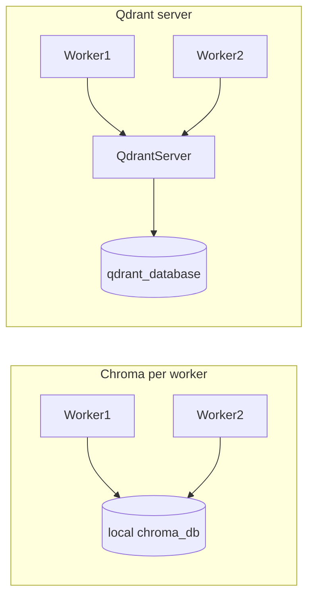
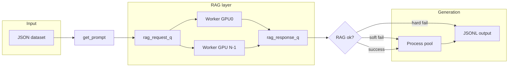

# MIRAGE-RAG — End-to-end pipeline guide

This document describes how data moves through the project: from offline preparation of the vector database and optional crop dictionary, through batch RAG inference and answer generation. It is aligned with the six in-repo Markdown references in **Section 8.2** and with the current implementation in `rag_agent/`, `preload_pipeline/`, and `Inference/`.

---

## 1. Introduction and repository map

### 1.1 What this system does

MIRAGE-RAG is built around a **retrieval-augmented** workflow backed by a **Qdrant** vector store in **server mode**. Documents are chunked, embedded in-process, and stored in Qdrant with metadata (including location and hardiness zone where applicable). RAG workers connect to the Qdrant server over HTTP—they do not open local database files directly. At query time, an LLM-driven **RAG agent** retrieves evidence, evaluates confidence, and may search the web and ingest new pages when confidence is low.

**Batch inference** (`Inference/generate.py`) runs many items through that RAG stack and then a separate **generation** step, using a multi-process, GPU-aware layout so RAG load is controlled and scalable.

**Offline ingestion** now runs from the notebook-first preload architecture in `preload_pipeline/NEW-ARCHITECTURE/` and is executed independently from inference (see [§3](#3-offline-pipeline-a--building-the-vector-database-preload)).

### 1.2 Main directories


| Path                | Role                                                                                                                                                                                                                                                         |
| ------------------- | ------------------------------------------------------------------------------------------------------------------------------------------------------------------------------------------------------------------------------------------------------------ |
| `rag_agent/`        | Qdrant client (`QdrantStore`), embeddings, chunking utilities, tools (retrieve, confidence, web search, web/PDF ingestion, keywords), and `MainAgent` (Google ADK `LlmAgent` + `InMemoryRunner`). |
| `preload_pipeline/` | Notebook-orchestrated preload pipeline: canonical store + SQLite ledger + qualification + embedding + cumulative Qdrant snapshots.                                                                                                                           |
| `Inference/`        | `generate.py`: dataset → RAG queue → per-GPU workers → generation pool → JSONL output. Optional crop **query enrichment** before RAG.                                                                                                                        |
| `chat_models/`      | Clients used by generation (and related chat flows).                                                                                                                                                                                                         |
| `Datasets/`         | Reference data (e.g. land-grant universities for URL-derived location).                                                                                                                                                                                      |


Run batch jobs from the `Inference/` directory. Before starting workers, run the **Qdrant server** and set `QDRANT_URL` (see [§2.1](#21-qdrant-server-and-collection-name) and [§5.9](#59-starting-the-qdrant-server)).

### 1.3 How to read this guide

- **Sections 2–4** cover shared concepts, **preload** (vector DB), and the **crop dictionary** (query enrichment only—not stored in Qdrant).
- **Sections 5–6** cover **batch inference** and **runtime RAG agent** behavior.
- **Section 7** covers ablation controls and the run matrix; **Section 8** is an operational checklist (cluster jobs, pre-run checks, monitoring, environment setup); **Section 9** lists primary files and doc references.
- **§3.8** and **§4.5** collect **working-directory-specific** commands for the vector DB and crop dictionary; **§5.8** covers local LLM servers; **§5.9** covers **starting the Qdrant server** (copy-paste steps).

---

## 2. Core concepts and shared artifacts

### 2.1 Qdrant server and base/runtime collections

- Inference uses two isolated Qdrant collections: **`mirage_base`** and one run-scoped **`mirage_runtime_<ABLATION_ID>_<YYYYMMDD>_<HHMMSS>`** collection.
- `mirage_base` is the curated offline preload database. Inference treats it as read-only: it may verify, search, scroll, and count it, but never creates, resets, deletes, or upserts it.
- The runtime collection is created or resumed by `InferenceDatabaseManager`, shared by all workers for one run, and receives web/PDF augmentation. It is deleted only after successful completion; failures and interruptions preserve it for resume.
- Set `USE_BASE_COLLECTION=False` (CLI: `--use_base_collection false`) only for runtime-only development/testing while `mirage_base` is unavailable. This skips base verification, retrieval, and base deduplication but uses the same lifecycle, retriever, ingestion, and confidence path.
- `MainAgent` connects with `QdrantClient(url=...)` to a **running Qdrant server**. Set the URL via environment variable **`QDRANT_URL`** (default `http://127.0.0.1:6333`) or constructor argument `qdrant_url=...`. Optional **`QDRANT_API_KEY`** for secured deployments.
- **On-disk storage** is owned by the Qdrant **server process**, not by each worker. Inference never discovers, copies, restores, or directly reads Qdrant storage directories. On this cluster, the typical storage path is `/work/nvme/bfox/ssingh38/qdrant_database`, configured when starting the server with **`QDRANT__STORAGE__STORAGE_PATH`** (see [§5.9](#59-starting-the-qdrant-server)).
- **Embeddings** are computed in-process by `SentenceTransformerEmbeddingFunction`; vectors are sent to Qdrant on upsert and query via `rag_agent/utils/qdrant_store.py` (`QdrantStore`).
- **Embedding model** should stay aligned between notebook preload and runtime retrieval to avoid vector/schema mismatches.
- **Device** for the sentence-transformer embedder should match (`--device` / `device`, often `"None"` for auto).

#### 2.1.1 Why we moved from ChromaDB to Qdrant (server mode)

Previously, each RAG worker opened the same Chroma persistence directory with `chromadb.PersistentClient(path=...)`. That caused problems in multi-worker batch inference:

- **Unsafe concurrent writes:** multiple workers reading/writing the same local SQLite/HNSW files risked contention and corruption.
- **Stale collection handles:** in the historical Chroma implementation, rank-0 collection resets could invalidate other workers' cached collection UUIDs. The current Qdrant architecture uses an externally managed server and a driver-owned runtime name, so workers do not perform resets.

**Qdrant server mode** fixes this: one Qdrant process owns storage on NVMe; all workers are HTTP clients to that single server. Concurrent upserts and queries are handled safely server-side.


```mermaid
flowchart LR
  subgraph before [Chroma per worker]
    W1[Worker1] --> Files[(local chroma_db)]
    W2[Worker2] --> Files
  end
  subgraph after [Qdrant server]
    W1Q[Worker1] --> Server[QdrantServer]
    W2Q[Worker2] --> Server
    Server --> NVMe[(qdrant_database)]
  end
```

**Operational model (three terminals):**

| Terminal | Role |
| -------- | ---- |
| 1 | Qdrant server (`~/bin/qdrant` with `QDRANT__STORAGE__STORAGE_PATH=...`) |
| 2 | GPU LLM server(s) + `Inference/generate.py` workers (`export QDRANT_URL=...`) |
| 3 | Batch driver (`Inference/bash_generate.sh` or your inference script) |

For migration details, see [MSCdocs/CHROMADB_TO_QDRANT_MIGRATION.md](MSCdocs/CHROMADB_TO_QDRANT_MIGRATION.md).

### 2.2 Two different artifacts: vector DB vs crop dictionary


| Artifact                            | Purpose                                                                                                                             | Consumed by                                                                                      |
| ----------------------------------- | ----------------------------------------------------------------------------------------------------------------------------------- | ------------------------------------------------------------------------------------------------ |
| **Qdrant base/runtime collections** (chunks + embeddings) | Curated retrieval plus run-scoped runtime augmentation | `DualCollectionRetriever`, confidence, and runtime-only web/PDF ingestion |
| **Crop dictionary JSON**            | Optional **query enrichment** only: may insert crop names into the user question when the query implies a crop but does not name it | `CropQueryEnricher` in `rag_agent/crop_query_enrichment.py`, called from `Inference/generate.py` |


The crop dictionary does **not** replace or duplicate the vector store; it only rewrites the **text** of the user message (with strict rules) before RAG runs.

### 2.3 Metadata — policy, storage, retrieval, and search

Project policy (see `preload_pipeline/NEW-ARCHITECTURE/metamirage_preload_final_architecture_updated.md` and `preload_pipeline/NEW-ARCHITECTURE/run.md`) includes:

- `**location`**: Used to derive `**hardiness_zone`** via `rag_agent.utils.metadata` helpers. Preferred forms: `**"State"**` or `**"State, County"**` (full state name or two-letter abbreviation).
- `**hardiness_zone**`: Expected when `location` resolves; may be empty if lookup cannot resolve.
- `**month_year**`: For preload web/PDF sources, provide `**YYYY-MM`** where available. CSV ingestion may leave `month_year` empty by design. Runtime web-search ingestion derives/validates `month_year` from search/page metadata per `rag_agent` tools.

Notebook preload preflight/input validation enforces:

- **CSV**: each source must have `**location`** or `**location_field`** (for per-row location).
- `**web_page_list` and `pdf_dir**`: each source must have `**location**` (for hardiness derivation).

#### 2.3.1 Canonical metadata stored on each chunk

Ingestion paths (web, PDF, CSV preload) ultimately attach metadata through `rag_agent.utils.metadata.build_canonical_chunk_metadata`. Typical **canonical keys** stored in each chunk **payload** in Qdrant include:


| Field            | Role                                                                                                                                                                                          |
| ---------------- | --------------------------------------------------------------------------------------------------------------------------------------------------------------------------------------------- |
| `source_type`    | Origin class (e.g. web, pdf, csv) for provenance and debugging.                                                                                                                               |
| `source_id`      | Stable identifier for the source record or URL slug.                                                                                                                                          |
| `title`          | Page or document title; used in **progressive retrieval** when the agent passes a `title` filter and in confidence **scope** scoring.                                                         |
| `url`            | Source URL or synthetic identifier; provenance and dedupe context.                                                                                                                            |
| `page`           | Page index within a PDF or logical page.                                                                                                                                                      |
| `chunk_index`    | Which token chunk within the page/record.                                                                                                                                                     |
| `location`       | Geographic scope you asserted at ingest time (`State` or `State, County`); drives **hardiness_zone** derivation when not passed explicitly.                                                   |
| `month_year`     | Publication or snapshot month `**YYYY-MM`** when known; enables time-scoped retrieval filters.                                                                                                |
| `content_hash`   | Hash of normalized chunk text; used to **skip duplicate** chunks on re-ingestion.                                                                                                             |
| `language`       | Document language tag when detected or defaulted.                                                                                                                                             |
| `hardiness_zone` | USDA-style zone string derived from `**location`** via `extract_hardiness_zone_for_location` (and county/state datasets); **required for location-aware filtering** when the lookup succeeds. |


Extra keys may be merged via `extra_metadata` on some paths (e.g. CSV tags). Empty or unknown values are often stored as sentinel placeholders in tools (`__null__` / `-1` patterns in `MainAgent`), while retrieval treats strings like `NULL`, `N/A` as missing when filtering.

**Why `location` is required at preload manifest level:** without a resolvable location, `hardiness_zone` may be empty, weakening metadata filters and making extension-style retrieval less precise.

#### 2.3.2 How query-time inputs map to filters

`retrieve_content` / `_tracked_retrieve_content` pass optional `**location`**, `**month_year`**, and `**title**` into `ContentUtils.retrieve_with_priority_filters`. The `**location` string is not matched directly** on chunks for filtering; it is normalized and used only to **derive `hardiness_zone`** (see comment in `ContentUtils.py`). Batch inference sets `MainAgent.current_location` from the dataset so the effective location matches the user’s state/county when the model omits an explicit location argument.

#### 2.3.3 Eligible candidate filters (the “priority ladder”)

`ContentUtils.retrieve_with_priority_filters` builds a **list of candidate strategies** (`filter_attempts`). Each entry is a `(strategy_name, where_filter)` pair. A strategy is **only added** if every metadata field it needs is present after cleaning (see §2.3.2): e.g. `hardiness_zone+month_year+title` is skipped unless `**hardiness_zone`**, `**month_year`**, and `**title**` are all non-empty.

The **append order** encodes design intent (prefer combinations that tie chunks to place, time, and document identity when data exists):

1. `hardiness_zone` + `month_year` + `title`
2. `hardiness_zone` + `title`
3. `title` alone
4. `month_year` alone
5. `hardiness_zone` + `month_year`
6. `hardiness_zone` alone
7. `**semantic_only`** — `where` is omitted; pure embedding similarity over the full collection.

If the query supplies no usable `title`/`month_year`/derived `hardiness_zone`, several combined strategies never appear, and the list may reduce to `**month_year`**, `**hardiness_zone**`, and/or `**semantic_only**` depending on what remains. That is why consistent ingest metadata improves precision when the user’s region and time are known.

**Important:** this ladder is **not** “first strategy that returns enough hits wins.” See §2.3.4.

#### 2.3.4 Priority retrieval: evaluation loop, similarity formula, and winner selection

Implementation reference: `rag_agent/utils/ContentUtils.py` — `retrieve_with_priority_filters`.

**Concept.** *Priority retrieval* means: for one user query, run **one Qdrant search per candidate strategy** (each with the same query embedding and `limit=k`, default 5). Every strategy that returns at least **`min_results`** hits (default 1) is **valid**. Among valid strategies, the implementation picks the one with the **highest normalized similarity score** (not the first in the list). So a broader filter can win if its top-k hits are semantically stronger than a stricter filter’s hits.

**Per-hit similarity (distance to score).** Qdrant returns a cosine **score** where higher is better. The code normalizes to a Chroma-compatible **distance** (`distance = 1.0 - score`) so downstream confidence logic is unchanged. For each hit `i` with distance `d_i >= 0`, the code converts to a **higher-is-better** similarity in `(0, 1]`:

```text
s_i = 1 / (1 + max(d_i, 0))
```

**Strategy score (normalized score for one candidate).** Let `n` be the number of documents returned for that query (up to `k`). The strategy’s aggregate score is the **mean** of per-hit similarities:

```text
normalized_score = (1 / n) * Σ s_i   for i = 1..n     (or 0 if n = 0)
```

**Winner selection.**

1. Evaluate **all** candidates in `filter_attempts` (including `semantic_only`).
2. **Valid** strategies are those with `doc_count >= min_results`.
3. If any valid strategy exists, choose
  `best_strategy = argmax normalized_score`  
   over valid strategies, breaking ties by Python’s `max` ordering on the list (deterministic given fixed evaluation order).
4. Return the `**where` clause**, **strategy name**, and **formatted hit list** from that winner. If none are valid, return `("no_results", [])` with no filter.

**Parameters.**


| Parameter     | Role                                                                                      |
| ------------- | ----------------------------------------------------------------------------------------- |
| `k`           | Top-k hits per strategy (`limit` in Qdrant / `k` in code).                                          |
| `min_results` | Minimum `doc_count` for a strategy to participate in the max-score selection (default 1). |


**Why this design.** Stricter metadata filters shrink the corpus; if that subset has weak embedding matches, a **looser** filter (or `semantic_only`) can still win on **average similarity**, keeping retrieval grounded in vector relevance while using metadata when it helps.

#### 2.3.5 Confidence scoring and metadata “scope”

`ConfidenceEvaluator.evaluate_retrieval_confidence` calls the same `**retrieve_with_priority_filters`** path, then applies a **separate** confidence model: similarity, coverage, consistency, and a **scope weight** tied to which **strategy name** won in §2.3.4. Higher weights apply when stricter filters win (e.g. `hardiness_zone+month_year+title` vs `semantic_only`). See `scope_weights` in `rag_agent/tools/confidence_evaluator.py` for the exact mapping. That means **better metadata alignment** (zone + month + title) both influences which chunks win priority retrieval and tends to raise **confidence_level**, reducing unnecessary web search.

#### 2.3.6 Web search and metadata (`WebSearch`)

`WebSearch.web_search` accepts `**use_domain_filter`** (default `True`). When this flag is `True`, and `**location`** is provided, `get_filtered_edu_domains_for_search` uses **state-linked** and **hardiness-zone-linked** `.edu` domains from `Datasets/land_grant_universities.csv` and `Datasets/hardiness_zone_edu_domain.csv` to restrict or prioritize extension/university sources. When `use_domain_filter` is `False`, web search runs as an open query (no `.edu` site-clause restriction). In `MainAgent`, `_tracked_web_search` supports an optional per-call override and otherwise uses the code-controlled class setting `self.use_domain_filter` for run-level ablations. Results carry `**month_year`** derived from `page_age` (or validated provider fields) for downstream `**_tracked_add_web_content`** so ingestion stays consistent with retrieval policies.

#### 2.3.7 Runtime vs preload responsibilities


| Stage               | Who sets `location` / zone / `month_year`                                                                             |
| ------------------- | --------------------------------------------------------------------------------------------------------------------- |
| Preload manifest    | You set `location` (and usually `month_year` for web/PDF); tools compute `hardiness_zone` at chunk write time.        |
| Runtime web ingest  | Search tool + `WebAddition` set `month_year` and often derive location from `.edu` domains when not explicitly given. |
| Batch `generate.py` | `get_prompt` builds `[User location: …]`; worker sets `current_location` for tools.                                   |


### 2.4 Shared ingestion behavior (preload vs runtime)

The notebook preload pipeline remains aligned with runtime retrieval contracts at the data level:

- Deterministic content identity and global deduplication via content hash.
- Metadata-normalized chunk payloads for location/hardiness/time-aware retrieval.
- Embedding + Qdrant insertion in batches with retry handling.

Operationally, preload now runs as an offline notebook workflow and no longer depends on inference-time bootstrap steps.

#### 2.4.1 Base/runtime isolation

The preload pipeline is responsible for constructing the curated `mirage_base` collection. Inference connects to the already-running Qdrant server and does not own base storage or promote runtime data into it.

```text
DualCollectionRetriever:       read base + read runtime
WebAddition / PDFAddition:     read base for dedupe, write runtime only
USE_BASE_COLLECTION=False:     read/write runtime only
```

Runtime content is run-scoped. A later query in the same run can retrieve content added by an earlier query; a new run gets a new runtime collection unless it explicitly resumes an interrupted one.

---

## 3. Offline pipeline A — Building the vector database (preload)

The preload pipeline now runs as a notebook-orchestrated offline build in `preload_pipeline/NEW-ARCHITECTURE/` and is intentionally decoupled from inference execution.

### 3.1 Architecture and execution model

- The orchestrator is the notebook `MetaMIRAGE_Cumulative_Qdrant_Preload_FIXED_FROM_YOURS.ipynb`.
- Qdrant runs as a separate server process on the same compute node and is accessed at `http://127.0.0.1:6333`.
- The pipeline persists state in four layers: SQLite processing ledger, canonical content store, Qdrant retrieval index, and cumulative snapshots.
- One cumulative working collection is used (for example `mirage_base_build`) and advanced state-by-state.

### 3.2 Data flow per state

```text
Source discovery
→ Extraction + normalization
→ Canonical persistence + SQLite ledger
→ Global deduplication
→ Qualification
→ Accept/reject decision
→ RAG chunking + metadata enrichment + metadata validation
→ Batch embedding + batch Qdrant upsert
→ Retry failed units
→ Terminal-state validation
→ Cumulative snapshot + manifest
→ Atomic update of current state in crop_occurrences.json
```

### 3.3 Input and support files

- Inputs are auto-discovered from the working directory with at most one matching PDF zip, one CSV zip, and one URL file pattern.
- At least one source type must be present for a run.
- `county_state_hardiness_zone.csv` and `crop_occurrences.json` must exist at the build root.

### 3.4 State progression and snapshots

- Runs are sequenced per build (for example `001_IL`, `002_IN`, `003_IA`).
- Each completed run emits a cumulative Qdrant snapshot and a run manifest under `runs/<build>/<run_id>/`.
- Snapshots are used for restart/reuse across compute allocations.

### 3.5 Deduplication, retries, and terminal states

- Document identity is content-hash based and global across states.
- Duplicate documents are recorded and skipped before qualification/indexing.
- Failures are retried by stage within the current run; unrecoverable items become permanently failed terminal units.
- Runs can still complete when terminal validation passes with documented permanent failures.

### 3.6 Crop occurrences behavior in preload

- `crop_occurrences.json` is a single cumulative artifact for all states.
- Each run updates only the current state section and preserves all other states untouched.
- State updates are atomic to avoid partial-file corruption.

### 3.7 How to run (notebook path)

From `preload_pipeline/NEW-ARCHITECTURE/`:

1. Start Qdrant with storage path configured.
2. Verify server health with `curl http://127.0.0.1:6333/collections`.
3. Open and run `MetaMIRAGE_Cumulative_Qdrant_Preload_FIXED_FROM_YOURS.ipynb` top-to-bottom.
4. Set build/state/run identifiers and confirm discovered inputs.
5. Enable `RUN_PIPELINE = True` in a dedicated cell, then execute the pipeline cell.

For detailed commands and safeguards, use:

- `preload_pipeline/NEW-ARCHITECTURE/run.md`
- `preload_pipeline/NEW-ARCHITECTURE/metamirage_preload_final_architecture_updated.md`
- `preload_pipeline/NEW-ARCHITECTURE/qdrant_delta_setup_context.md`

---

## 4. Offline pipeline B — Crop dictionary for query enrichment

### 4.1 Purpose

Some user questions refer to **category-level** crop information (pests, diseases, fields in a structured crop record) **without naming the crop**. Optional **query enrichment** uses a **JSON crop dictionary** (organized by state) and a **single LLM call** to insert **allowed** crop names into the **question body only**, then recombine with an unchanged `**[User location: …]`** prefix. Details: `preload_pipeline/Dict-Value-Database/QUERY_ENRICHMENT_CONTEXT.md`.

### 4.2 Building the dictionary

- The authoritative build scripts live under `preload_pipeline/Dict-Value-Database/scripts/` (e.g. `**build_crop_dictionary.py`**).
- YAML `**url_batches**` for that pipeline can be produced with `preload_pipeline/Dict-Value-Database/scripts/generate_web_sources.py` (see `preload_pipeline/Dict-Value-Database/scripts/generate_web_sources.md`): `**--base-url**`, `**--names-file**`, `**--state**`, `**--category**`, `**--output**`, optional `**--url-style**`.

### 4.3 Runtime placement and CLI (`Inference/`)

- Default: place `**CropDatabase.json**` in the same directory as `Inference/generate.py`, or pass `**--crop_dictionary_path**` (relative paths resolve against `Inference/`).
- `**--disable_query_enrichment**`: turns enrichment off even if a file path is set.
- Empty `**--crop_dictionary_path**` (`""`) disables enrichment.

If the file is missing, `Generate` logs and runs with enrichment effectively off.

### 4.4 Implementation behavior (`rag_agent/crop_query_enrichment.py`)

- **Not** dependent on Qdrant or ADK; uses the OpenAI-compatible client against the **same `api_base` and model** as that RAG worker.
- Splits the full user string into `**prefix`** (optional `[User location: …]\n\n`) and `**body`** via regex.
- If enrichment is enabled and a dictionary is loaded, the worker passes a **state slice** of the JSON (matching the state from the location line) plus an **allowlist** of crop names into one chat completion.
- **Fallback:** on any failure (missing state in dict, empty list, serialize error, LLM error, bad JSON, or model output that is not a pure **insertion** supersequence of the original body), `**enrich()` returns the original full query unchanged**.
- Dictionary size is capped for prompting (`_MAX_DICT_JSON_CHARS`); allowlist text may truncate with a note.

### 4.5 Creating the crop database for query enrichment — working directory and commands

**Run the Dict–Value–Database scripts from `preload_pipeline/Dict-Value-Database/`** (the project’s “Dict-Value Database” directory—not the repo root) so relative paths such as `../Datasets/...` resolve as in `preload_pipeline/docs/README.md`.

Example sequence:

```bash
cd preload_pipeline/Dict-Value-Database

python scripts/generate_web_sources.py \
  --base-url "https://extension.illinois.edu/plant-problems/" \
  --names-file "../Ingestion/URLs/names/uiuc.txt" \
  --state "Illinois" \
  --category "disease" \
  --output "YAMLfilesForDict/uiuc.yaml"

python scripts/build_crop_dictionary.py \
  --config YAMLfilesForDict/uiuc.yaml \
  --csv ../../Datasets/county_crops_frequency_multi_year_cleaned.csv \
  --output output/crop_dictionary_output.json
```

Here `../Ingestion/...` reaches `preload_pipeline/Ingestion/...`, and `../../Datasets/...` reaches the repo-root `Datasets/` CSV. If your checkout layout differs, use absolute paths. Copy or symlink the built JSON to `Inference/CropDatabase.json` (or pass `--crop_dictionary_path`) for batch runs.

---

## 5. Runtime pipeline — Batch inference (`Inference/generate.py`)

### 5.1 End-to-end data flow

1. Load JSON dataset from `**--input_file**`.
2. Skip items already successfully written to `**--output_file**` (JSONL) for the chosen answer model key.
3. Build a **multiprocessing** context with `**spawn`**.
4. Detect **GPU count** (`torch.cuda.device_count()`); if zero, treat as **one** logical GPU.
5. Build one OpenAI-compatible **endpoint per GPU**: `http://<host>:<11434 + i>/v1` unless `--openai_api_base` supplies a host/scheme (see `_build_endpoints`).
6. Create `**rag_request_q`** (bounded by `num_gpus * rag_inflight_per_gpu`, default inflight 2 per GPU) and `**rag_response_q`**.
7. Start **rank-0** RAG worker first; wait until it signals **READY** on `**rag_status_q`** (timeout 300s). If rank0 fails, abort.
8. Start remaining RAG workers; wait until all **READY**.
9. For each item, `**get_prompt`** builds `prompt["user"]` (optional `[User location: state, county]\n\n` + question), `**images`**, and `**location**`.
10. The run-level `**ablation_id**` is provided by `Inference/bash_generate.sh` (`ABLATION_ID`) to `Inference/generate.py` (`--ablation_id`) and forwarded into each `MainAgent` instance.
11. Workers dequeue `(item_id, prompt["user"], location, attempt)`, set `**current_location**`, run `**CropQueryEnricher.enrich**` → `**effective_query**`, then `**run_debug(effective_query, session_id=...)**`.
12. Inside `MainAgent`, the agent resolves `ablation_id` against `rag_agent/ablation_configs.json`, applies toggles, builds the tool list from toggles, and resolves the instruction template key.
13. Main process receives `**(item_id, rag_answer, error, web_search_flag, endpoint, attempt, effective_query)**`.
14. On **successful** RAG (not soft failure), build
  `**enhanced = effective_query + "\n\nadditional context: " + rag_answer`**  
    and dispatch `**generation_worker`** with that string.
15. On **soft** RAG failure, `**enhanced = effective_query`** (no context block), generation still runs.
16. On **hard** RAG failure, optional **retry** up to `**max_rag_attempts`** (2); else write item with hard-fail status and **skip generation**.

### 5.2 GPU endpoints and scaling

- Each worker binds to `**api_base`** for the LLM (RAG agent + enrichment both use that base URL).
- Port numbering starts at **11434** and increments by one per GPU when using default host.

### 5.3 Database lifecycle and worker barrier

The inference driver, not an individual worker, owns collection lifecycle. Before workers start, it:

1. Connects to Qdrant.
2. Verifies `mirage_base` only when `USE_BASE_COLLECTION=True`.
3. In `resume` mode, selects the newest matching runtime collection for the current ablation, or creates a new timestamped one.
4. In `fresh` mode, deletes only matching runtime collections for the current ablation, then creates a new empty runtime collection.
5. Creates/verifies runtime payload indexes and passes the selected runtime name explicitly to every worker.

Workers all connect to the same `mirage_base` (when enabled) and the same active runtime collection. No worker resets a collection, discovers a different runtime, or mutates the base. The rank-0 READY barrier still prevents request processing until all worker agents are initialized.

Runtime modes:

- `--runtime_mode resume` (default): reuses interrupted runtime state and existing JSONL query/evaluation progress.
- `--runtime_mode fresh`: abandons current-ablation runtime collections and starts inference from query 0. Existing output progress is ignored for that run.
- `--runtime_collection_override NAME`: explicitly resumes one existing runtime collection; valid only with `resume`.
- `--snapshot_runtime`: requests a Qdrant snapshot on successful completion before deleting the live runtime collection. Snapshot failure preserves the runtime.

### 5.4 Qdrant connectivity during inference

If Qdrant is unreachable (server stopped, wrong `QDRANT_URL`, network error), retrieval and ingestion tools fail and may classify as hard or soft RAG failures per **§5.5**. **Keep the Qdrant server running** for the full inference job (Terminal 1 in [§2.1.1](#211-why-we-moved-from-chromadb-to-qdrant-server-mode)).

The old single-collection reset and Chroma **stale-handle self-heal** paths are not part of normal inference. If the run fails, the active runtime collection remains available for `resume`; `mirage_base` is never deleted or changed.

### 5.5 RAG failure classification

- `**_is_hard_rag_failure`**: connection/timeouts/5xx/“exception” style errors → retry then hard fail.
- `**_is_soft_rag_failure`**: short or empty answers, or non-hard errors → fallback to `**effective_query**` without RAG context, still generate.

### 5.6 Other notable parameters

- `**max_retries` / `retry_delay**`: generation retries per item (defaults 5 / 5s).
- RAG workers periodically **re-instantiate** `MainAgent` every **1000** requests to limit drift (see `RESTART_INTERVAL` in `generate.py`).

### 5.7 Diagram (batch path)


```mermaid
flowchart LR
  subgraph input [Input]
    DS[JSON dataset]
  end
  subgraph ragLayer [RAG layer]
    RQ[rag_request_q]
    W1[Worker GPU0]
    WN[Worker GPU N-1]
    RR[rag_response_q]
  end
  subgraph genLayer [Generation]
    GP[Process pool]
    OUT[JSONL output]
  end
  DS --> getPrompt[get_prompt]
  getPrompt --> RQ
  RQ --> W1
  RQ --> WN
  W1 --> RR
  WN --> RR
  RR --> decide{RAG ok?}
  decide -->|soft fail| GP
  decide -->|success| GP
  decide -->|hard fail| OUT
  GP --> OUT
```


### 5.8 Serving LLM backends (OpenAI-compatible API)

Batch inference and the RAG agent expect an **OpenAI-compatible** HTTP API (for example `**http://127.0.0.1:11434/v1`** for the first GPU). `**Inference/generate.py`** builds endpoints starting at port **11434** and increments by one per detected GPU.

**Run these commands from the repository root** so paths like `./chat_template.jinja` resolve correctly for vLLM.

#### SGLang (example: bind to one CUDA device)

CUDA device indices start at **0**. To dedicate **GPU 0** to the server on port 11434:

```bash
CUDA_VISIBLE_DEVICES=0 python -m sglang.launch_server \
  --model-path meta-llama/Llama-3.2-11B-Vision-Instruct \
  --host 127.0.0.1 \
  --port 11434 \
  --tensor-parallel-size 1 \
  --tool-call-parser llama3 \
  --enable-multimodal \
  --trust-remote-code \
  --mem-fraction-static 0.9 \
  --max-total-tokens 32768
  --attention-backend flashinfer
```

Use `CUDA_VISIBLE_DEVICES=1`, port **11435**, and so on, for additional GPUs to match `generate.py`’s endpoint list.

#### vLLM (vision-language / tool-calling example)

```bash
python -m vllm.entrypoints.openai.api_server \
  --model Qwen/Qwen2.5-VL-7B-Instruct \
  --host 127.0.0.1 \
  --port 11434 \
  --tensor-parallel-size 1 \
  --enable-auto-tool-choice \
  --tool-call-parser hermes \
  --chat-template ./chat_template.jinja
```

Model IDs, ports, and templates should match your deployment; align `**--test_model` / `--model_name**` in `generate.py` with the served model name.

### 5.9 Starting the Qdrant server

Follow these steps **before** starting `Inference/generate.py` or any `MainAgent` worker. **`pip install qdrant-client` installs the Python client only**—it does **not** install the `qdrant` server command.

#### Step 1 — Install the Python client (once per venv)

From your activated environment (e.g. `mirage`):

```bash
pip install qdrant-client==1.18.0
python -c "from qdrant_client import QdrantClient; print('qdrant-client OK')"
```

#### Step 2 — Download the Qdrant server binary (once per user)

On Linux x86_64 clusters, use the **musl** build if the gnu build fails with `GLIBC_2.38 not found`:

```bash
mkdir -p ~/bin
cd ~/bin
wget https://github.com/qdrant/qdrant/releases/download/v1.18.0/qdrant-x86_64-unknown-linux-musl.tar.gz
tar -xzf qdrant-x86_64-unknown-linux-musl.tar.gz
chmod +x qdrant
./qdrant --version
```

Optional: add `~/bin` to your PATH for the session:

```bash
export PATH="$HOME/bin:$PATH"
```

#### Step 3 — Create the storage directory

```bash
mkdir -p /work/nvme/bfox/ssingh38/qdrant_database
```

Adjust the path if your site uses a different NVMe mount.

#### Step 4 — Start the server (Terminal 1; keep this running)

Qdrant **1.18+** does **not** accept `--storage-path` on the command line. Set storage via environment variable:

```bash
export QDRANT__STORAGE__STORAGE_PATH=/work/nvme/bfox/ssingh38/qdrant_database
~/bin/qdrant
```

Or as a one-liner:

```bash
QDRANT__STORAGE__STORAGE_PATH=/work/nvme/bfox/ssingh38/qdrant_database ~/bin/qdrant
```

**Run in the background** (optional):

```bash
nohup env QDRANT__STORAGE__STORAGE_PATH=/work/nvme/bfox/ssingh38/qdrant_database \
  ~/bin/qdrant > ~/qdrant.log 2>&1 &
tail -f ~/qdrant.log
```

**Alternative — config file:** create `~/qdrant_config.yaml`:

```yaml
storage:
  storage_path: /work/nvme/bfox/ssingh38/qdrant_database
service:
  host: 0.0.0.0
  http_port: 6333
  grpc_port: 6334
```

Then start with:

```bash
~/bin/qdrant --config-path ~/qdrant_config.yaml
```

**Alternative — Docker** (if `docker` is available on the node):

```bash
docker run -p 6333:6333 -p 6334:6334 \
  -v /work/nvme/bfox/ssingh38/qdrant_database:/qdrant/storage \
  qdrant/qdrant
```

#### Step 5 — Verify the server

In another terminal:

```bash
curl http://127.0.0.1:6333/collections
```

You should receive JSON (possibly an empty `collections` list on first start).

#### Step 6 — Point RAG workers at the server (Terminal 2+)

```bash
export QDRANT_URL=http://127.0.0.1:6333
cd /path/to/MIRAGE-RAG   # repository root
python -c "from rag_agent.main import MainAgent; a=MainAgent(device='cuda'); print('count', a.store.count())"
```

Expected log lines include `[RAG Init] Qdrant URL: http://127.0.0.1:6333`.

#### Step 7 — Three-terminal layout for a full run

| Terminal | Role | What to run |
| -------- | ---- | ----------- |
| **1** | Qdrant server | `QDRANT__STORAGE__STORAGE_PATH=... ~/bin/qdrant` |
| **2** | LLM + RAG workers | Start SGLang/vLLM per **§5.8**, then `export QDRANT_URL=...` and `python Inference/generate.py ...` |
| **3** | Batch driver | `Inference/bash_generate.sh` or your inference script |

**Smoke test** (optional, no LLM required beyond embeddings):

```bash
export QDRANT_URL=http://127.0.0.1:6333
python rag_agent/test_qdrant_migration.py
```

---

## 6. Runtime pipeline — RAG agent behavior (`rag_agent`)

### 6.1 Agent contract (tools-first)

`MainAgent.main()` configures an `**LlmAgent**` ("Rag_Agent") whose instructions require **function calling** (no fake tool outputs in plain text).  

Runtime behavior is now **ablation-driven**:

- `ablation_id` is resolved in `MainAgent` against `rag_agent/ablation_configs.json`.
- Resolved settings assign toggles (`use_progressive_filtering`, `use_confidence_eval`, `use_web_search`, `use_domain_filter`, `use_ingestion_loop`).
- Tool exposure is then gated from toggles (retrieve always available; confidence/web/ingestion tools only when corresponding toggles are enabled).
- Instruction template selection first tries `templates[ablation_id]` in `rag_agent/model_instructions.md`; if missing, fallback is `fallback_ablation`.

Because of this, the exact tool-call sequence is **template-dependent per ablation**, not a single fixed path for all runs.

### 6.2 Location handling

- User messages may begin with `**[User location: X]`**; that string is passed through to retrieve and web search as required by the agent instructions.
- `**_tracked_add_web_content`** does not take a user-supplied location in the same way; location for `.edu` URLs can be **derived** from the institution’s state (see metadata policy in `preload_pipeline/docs/README.md` and `Datasets/land_grant_universities.csv`).

### 6.3 Assumptions for RAG

- An **OpenAI-compatible** server is reachable at **`api_base`** for the tool-calling model.
- A **Qdrant server** is running and reachable at **`QDRANT_URL`** (default `http://127.0.0.1:6333`).
- `mirage_base` must already exist for normal inference. The active runtime collection starts empty for a new/fresh run and accumulates chunks during the run via web/PDF ingestion tools when enabled.
- Runtime schema is fixed to `BAAI/bge-base-en-v1.5`, 768 dimensions, cosine distance, with payload indexes for `hardiness_zone`, `month_year`, `title`, and `content_hash`.
- If `USE_BASE_COLLECTION=False`, `mirage_base` need not exist and no placeholder base collection is created.
- **Embedding model** and tokenizer settings align with how chunks were ingested (default `BAAI/bge-base-en-v1.5`).

---

## 7. Ablation setup and matrix

### 7.1 Ablation controls (toggle + templates)

Runtime ablation control now uses three linked pieces:

1. **Run selector**: `Inference/bash_generate.sh` sets `ABLATION_ID`, passed to `Inference/generate.py` as `--ablation_id`, then into `MainAgent(ablation_id=...)`.
2. **Settings map**: `rag_agent/ablation_configs.json` provides run-level ON/OFF values (currently IDs 2,3,4,5,7,8).
3. **Instruction templates**: `rag_agent/model_instructions.md` sections are keyed with markers `<!-- instruction:<key> -->`; parser supports `[a-z0-9_]+` keys and first attempts the `ablation_id` key.

If an ablation template key is absent, `MainAgent` falls back to:

- `fallback_ablation`

In fallback mode, `MainAgent` also uses the full/default function list:

- `_tracked_retrieve_content`
- `_tracked_evaluate_confidence`
- `_tracked_web_search`
- `_tracked_extract_keywords`
- `_tracked_add_web_content`
- `_tracked_add_pdf_content`

Toggle assignment and tool gating in `MainAgent`:

- `progressive_filtering_on` -> `use_progressive_filtering`
- `confidence_on` -> `use_confidence_eval` (for configured ablation IDs)
- `web_search_on` -> `use_web_search`
- `domain_filter_on` -> `use_domain_filter`
- `ingestion_loop_on` -> `use_ingestion_loop`

Tools are listed/unlisted deterministically from these toggles:

- Always: `_tracked_retrieve_content`
- Confidence ON: `_tracked_evaluate_confidence`
- Web search ON: `_tracked_web_search`, `_tracked_extract_keywords`
- Ingestion loop ON: `_tracked_add_web_content`, `_tracked_add_pdf_content`

Progressive retrieval remains a first-class toggle under ablation control:

- `MainAgent.use_progressive_filtering` (default `True`) controls whether retrieval uses progressive metadata strategies or semantic-only mode across the agent.
- `MainAgent.retrieve_content(...)` accepts `use_progressive_filtering: Optional[bool] = None`; when omitted, it uses `self.use_progressive_filtering`.
- `MainAgent._tracked_evaluate_confidence(...)` accepts the same optional override and forwards the effective value into confidence evaluation.
- `ConfidenceEvaluator.evaluate_retrieval_confidence(...)` forwards `use_progressive_filtering` into `ContentUtils.retrieve_with_priority_filters(...)`.
- `ContentUtils.retrieve_with_priority_filters(...)` behavior:
  - `use_progressive_filtering=True`: evaluates the full progressive strategy list plus `semantic_only`.
  - `use_progressive_filtering=False`: runs `semantic_only` only.

This supports full-run ablations by setting a single class-level flag while preserving optional per-call overrides for targeted experiments.

### 7.2 Ablation matrix (documented set + custom)

The matrix below follows the requested ablation set and ordering. Displayed keys use simplified names (without the `ablation_` prefix).


| Ablation key                  | Name                           | Db  | Crop Dict | Progressive Filtering | Confidence | Web Search | Domain Filter | Ingestion Loop |
| ----------------------------- | ------------------------------ | --- | --------- | --------------------- | ---------- | ---------- | ------------- | -------------- |
| `baseline`                    | Baseline                       | OFF | OFF       | OFF                   | OFF        | OFF        | OFF           | OFF            |
| `static_rag`                  | Static RAG                     | ON  | OFF       | OFF                   | OFF        | OFF        | OFF           | OFF            |
| `static_rag_crop_dict`        | Static RAG + Crop Dict         | ON  | ON        | OFF                   | OFF        | OFF        | OFF           | OFF            |
| `progressive_rag`             | Progressive RAG                | ON  | OFF       | ON                    | OFF        | OFF        | OFF           | OFF            |
| `uncertainty_aware_rag`       | Uncertainty-Aware RAG          | ON  | ON        | ON                    | ON         | OFF        | OFF           | OFF            |
| `custom_db_off_crop_dict_off` | Custom_db_off_crop_dict_off    | OFF | OFF       | ON                    | ON         | ON         | ON            | ON             |
| `full_no_domain_filter`       | Full System (No Domain Filter) | ON  | ON        | ON                    | ON         | ON         | OFF           | ON             |
| `full_domain_filtered`        | Full System (Domain Filtered)  | ON  | ON        | ON                    | ON         | ON         | ON            | ON             |


---

## 8. Operational checklist

### 8.1 Before preload

- Install `**pip install -r requirments.txt`** from the **repository root** (see §8.7). Filename `**requirments.txt`** (**spelling deliberate**).
- Start Qdrant on the same node/session as Jupyter and verify `curl http://127.0.0.1:6333/collections` works.
- Ensure support files exist in the preload working directory: `county_state_hardiness_zone.csv` and `crop_occurrences.json`.
- Ensure only intended state input files are present for auto-discovery (PDF zip / CSV zip / URL file patterns).
- Ensure enough disk for canonical storage, snapshots, and run artifacts.

### 8.2 Before batch inference (`generate.py`)

- **Start Qdrant** and verify connectivity (**§5.9**): `curl http://127.0.0.1:6333/collections`.
- **`export QDRANT_URL=http://127.0.0.1:6333`** (or your server host/port) in the worker environment.
- Start one **LLM server per GPU** on the expected ports (or configure **`--openai_api_base`** host consistently with `_build_endpoints`).
- Normal runs require the curated **`mirage_base`** collection to exist before startup. The driver creates or resumes an ablation-scoped runtime collection; it never resets the base.
- Choose `--runtime_mode resume` to continue an interrupted run, or `--runtime_mode fresh` to delete only the current ablation’s runtime collections and restart from query 0.
- Use `--use_base_collection false` only for runtime-only development/testing. Use `--snapshot_runtime` when a successful run should be snapshotted before runtime cleanup.
- Match **`--embed_model_name`** and **`--device`** to your embedding setup.
- Set run-level ablation in `Inference/bash_generate.sh` via **`ABLATION_ID`** (forwarded as `--ablation_id`).
- Confirm the selected `ABLATION_ID` exists in `rag_agent/ablation_configs.json` (currently documented IDs: 2,3,4,5,7,8).
- Confirm `rag_agent/model_instructions.md` has a matching `<!-- instruction:<ablation_id> -->` section (or intentional fallback to `fallback_ablation`).
- If using enrichment: place **`CropDatabase.json`** or pass **`--crop_dictionary_path`**; use **`--disable_query_enrichment`** to force-disable.

### 8.3 Troubleshooting pointers

- **Qdrant `Connection refused` on `:6333`:** server not running—start Terminal 1 per **§5.9**.
- **`GLIBC_2.38 not found` when running `./qdrant`:** use the **musl** tarball, not the gnu build (**§5.9** Step 2).
- **`unexpected argument '--storage-path'`:** Qdrant 1.18+ uses **`QDRANT__STORAGE__STORAGE_PATH`**, not `--storage-path`.
- **`qdrant: command not found`:** `pip install qdrant-client` does not install the server binary—download from GitHub releases (**§5.9** Step 2).
- **Keyword extraction reliability:** `Documentation.md` notes a **fresh client per `extract_keywords` call** in `KeywordExtractor` to avoid context overflow when reusing sessions.
- **Enrichment disabled unexpectedly:** missing file at resolved path, or **`--disable_query_enrichment`**; workers log when the dictionary is missing or enrichment is off.

### 8.4 Submitting jobs on an HPC cluster (example: Delta)

For scheduled GPU work, **run login and submission steps from your usual shell** (project workflows often use the repo root or a checkout named `MetaMirage` on the cluster). Example flow from internal notes:

1. SSH into the login node (example): `ssh <user>@login.delta.ncsa.illinois.edu` (authenticate per site policy, e.g. Duo).
2. Activate your Python or module environment.
3. Create a Slurm job script under your project’s job directory (e.g. `MetaMirage/job_scripts`).
4. Submit: `sbatch job_request.slurm` — note the printed job id (e.g. `Submitted batch job 123456`).
5. Monitor: `squeue -u $USER`.

Adapt account, partition, GPU flags, and paths to your site’s Slurm configuration.

### 8.5 Pre-run health checks

Before long runs, verify resources and basic connectivity (adapt paths and ports to your deployment).


| Check                            | Command or action                                                                            |
| -------------------------------- | -------------------------------------------------------------------------------------------- |
| Disk space on output volume      | `df -h /path/to/output/directory`                                                            |
| GPU visibility and memory        | `nvidia-smi`                                                                                 |
| Qdrant server reachable          | `curl http://127.0.0.1:6333/collections`                                                     |
| RAG stack → Qdrant               | `QDRANT_URL=http://127.0.0.1:6333 python -c "from rag_agent.main import MainAgent; a=MainAgent(); print('count', a.store.count())"` |
| RAG stack imports                | `python -c "from rag_agent.main import MainAgent; agent = MainAgent(); print('RAG OK')"`     |
| OpenAI-compatible API (optional) | `curl http://127.0.0.1:8000/v1/models` — use your `--openai_api_base` host/port if different |
| Writable output path             | `touch /path/to/output/file.jsonl && rm /path/to/output/file.jsonl`                          |
| Live resource view               | `htop` or `top`                                                                              |


**Login-node disk pressure (shared clusters):** if home is full, inspect usage with `du -sh ~/.??* | sort -h`; caches often dominate—`rm -rf ~/.cache` may help after you confirm nothing else depends on that cache.

### 8.6 Monitoring during batch inference


| Goal                              | Example                                                          |
| --------------------------------- | ---------------------------------------------------------------- |
| Output JSONL line count over time | `watch -n 60 'wc -l output.jsonl'`                               |
| GPU memory                        | `watch -n 60 'nvidia-smi'`                                       |
| `generate.py` process             | `ps aux` and search for `generate.py`                            |
| RAG worker processes              | `ps aux` and search for `rag_worker_process`                     |
| Errors in output                  | `tail -f output.jsonl` (optionally pipe through `grep -i error`) |


### 8.7 Example Python environment (HPC-style, SGLang)

Illustrative steps for a clean venv. Install the **single** consolidated pin list from the checkout root:

```bash
module purge
module load python/3.12.1
python --version
python3 -m venv mirage
source mirage/bin/activate
pip install --upgrade pip wheel setuptools
cd /path/to/MIRAGE-RAG    # MIRAGE-RAG repository root — adjust checkout path
pip install -r requirements.txt
python -c "import torch; import importlib.metadata as m; print('torch', torch.__version__, '| SGLang', m.version('sglang'), '| vLLM', m.version('vllm'))"
```

If `**pip install -r requirements.txt**` fails on CUDA or vendor wheels for your GPU driver or cluster policy, install PyTorch and CUDA libraries using your operator’s prescribed index/modules first, `**pip install --no-deps**` selective packages second, then re-run `**pip install -r requirements.txt**` (expect some “already satisfied” lines).

### 8.7.1 `requirements.txt` — consolidated environment

Repo-root **`requirements.txt`** is the **only** pinned dependency manifest: **preload**, **embedding + Qdrant client**, **`sglang`** / **`vllm`**, ADK / Google client stacks, and CUDA-associated wheels (**~348** `package==version` entries, **`pip`** / **`setuptools`** / **`wheel`** and **Jupyter/notebook tooling** intentionally omitted — not part of this codebase). Regenerate periodically from `pip freeze` after upgrades and replace this file (**spelling deliberate**).

Then start an OpenAI-compatible **SGLang** server on the port your batch job expects (same invocation as **§5.8**; `Inference/generate.py` defaults map GPU **i** to port **11434 + i** unless you override `--openai_api_base`):

```bash
CUDA_VISIBLE_DEVICES=0 python -m sglang.launch_server \
  --model-path meta-llama/Llama-3.2-11B-Vision-Instruct \
  --host 127.0.0.1 \
  --port 11434 \
  --tensor-parallel-size 1 \
  --tool-call-parser llama3 \
  --enable-multimodal \
  --trust-remote-code \
  --mem-fraction-static 0.9 \
  --max-total-tokens 32768
```

Use `CUDA_VISIBLE_DEVICES=1`, port **11435**, and so on, for additional GPUs to match `generate.py`'s endpoint list.

Align `**Inference/generate.py`** flags (`--openai_api_base`, `--test_model`, etc.) with this server (model ID and multimodal/tool settings must agree with `**--model-path**` above). On clusters, prefer job scripts that load modules, activate the venv, and launch the server on the allocated node. For a vLLM-based alternative server, see **§5.8**.

---

## 9. Appendix

### 9.1 File index (primary entry points)


| Topic                                                                      | Path                                                                    |
| -------------------------------------------------------------------------- | ----------------------------------------------------------------------- |
| Batch inference CLI                                                        | `Inference/generate.py`                                                 |
| Batch run wrapper + ablation selector                                      | `Inference/bash_generate.sh` (`ABLATION_ID`)                            |
| RAG agent + tools                                    | `rag_agent/main.py`, `rag_agent/tools/`                                 |
| Qdrant store adapter                                 | `rag_agent/utils/qdrant_store.py`                                       |
| Qdrant migration smoke test                          | `rag_agent/test_qdrant_migration.py`                                    |
| Ablation settings map                                                      | `rag_agent/ablation_configs.json`                                       |
| Instruction templates (`confidence_`*, `ablation_*`)                       | `rag_agent/model_instructions.md`                                       |
| Query enrichment                                                           | `rag_agent/crop_query_enrichment.py`                                    |
| Preload notebook orchestrator                                              | `preload_pipeline/NEW-ARCHITECTURE/MetaMIRAGE_Cumulative_Qdrant_Preload_FIXED_FROM_YOURS.ipynb` |
| Preload architecture reference                                             | `preload_pipeline/NEW-ARCHITECTURE/metamirage_preload_final_architecture_updated.md` |
| Preload run guide                                                          | `preload_pipeline/NEW-ARCHITECTURE/run.md`                              |
| Crop dictionary build                                                      | `preload_pipeline/Dict-Value-Database/scripts/build_crop_dictionary.py` |
| Python dependency pins (`pip install -r`)                                  | `requirments.txt` (repo root; see §8.7.1)                               |


### 9.2 Cross-references (in-scope Markdown sources)


| Document                                                               | Contents                                                                                        |
| ---------------------------------------------------------------------- | ----------------------------------------------------------------------------------------------- |
| `MSCdocs/CHROMADB_TO_QDRANT_MIGRATION.md`                              | Chroma → Qdrant API mapping and migration history                                                |
| `Documentation.md`                                                     | Multi-GPU queue design, shared runtime collection, RAG failure handling, keyword extractor note |
| `preload_pipeline/NEW-ARCHITECTURE/metamirage_preload_final_architecture_updated.md` | Final notebook preload architecture and persistence model                                        |
| `preload_pipeline/NEW-ARCHITECTURE/run.md`                            | Step-by-step execution for state runs                                                            |
| `preload_pipeline/NEW-ARCHITECTURE/qdrant_delta_setup_context.md`     | Qdrant server setup, snapshot create/restore, and notebook integration                           |
| `Inference/README.md`                                                  | Crop DB filename and enrichment flags                                                           |
| `preload_pipeline/Dict-Value-Database/QUERY_ENRICHMENT_CONTEXT.md`     | Enrichment design and `effective_query` data flow                                               |
| `preload_pipeline/Ingestion/URLs/scripts/generate_web_sources.md`      | Manifest `web_page_list` YAML generation                                                        |
| `preload_pipeline/Dict-Value-Database/scripts/generate_web_sources.md` | Dict-builder batch YAML generation                                                              |


---

*End of Guide*
