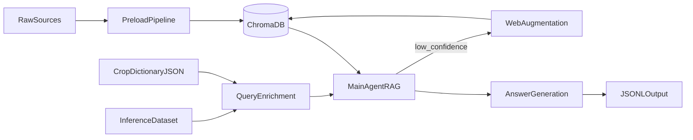
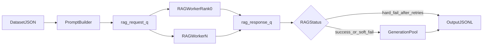

# MIRAGE-RAG

MIRAGE-RAG is an end-to-end agricultural retrieval-augmented generation system built for large-scale batch inference. It combines offline knowledge ingestion, metadata-aware retrieval, confidence-guided web augmentation, and multi-process GPU runtime orchestration.

This codebase is built on top of the MIRAGE benchmark project and extends it with a production-style RAG pipeline, ingestion stack, and ablation-driven runtime controls.

## Architecture At A Glance

- **Offline preload** writes chunked, embedded, metadata-rich documents into persistent Chroma.
- **Optional query enrichment** injects crop context into the user question when crop names are implicit.
- **Runtime RAG workers** retrieve evidence, score confidence, and optionally augment via web ingestion.
- **Generation stage** combines `effective_query` and retrieved context to produce final outputs.
- **Ablation controls** toggle key mechanisms (progressive filtering, confidence, web search, domain filtering, ingestion loop) for controlled experiments.



## Setup

### Prerequisites

- **Python** 3.12+ recommended (match your cluster modules if applicable).
- **Git** for checkout.
- **GPU + CUDA-compatible driver** for batch inference and for embedding offload at scale; preload can run CPU-only depending on workload (slower).

### Install

```bash
git clone <repository-url>
cd <repo-directory>   # checkout directory name, often MIRAGE-RAG

python -m venv .venv
# Windows PowerShell:
# .\.venv\Scripts\Activate.ps1
# Linux / macOS:
source .venv/bin/activate

python -m pip install --upgrade pip wheel setuptools
pip install -r requirments.txt
```

Install **from the repository root** so `pip` resolves paths correctly.

**Pin file.** **`requirments.txt`** (spelling deliberate) is the single consolidated **`package==version`** snapshot for preload, Chroma/embeddings, **`sglang`/`vllm`**, ADK-era clients, and CUDA-associated wheels (**~346** pins; **`pip`/`setuptools`/`wheel`** are omitted). Refresh from **`pip freeze`** when you recreate a canonical environment (**`Guide.md` §§8.7–8.7.1**).

### Optional sanity check

```bash
python -c "import torch; import importlib.metadata as m; print('torch', torch.__version__, '| SGLang', m.version('sglang'))"
python -c "import chromadb, sentence_transformers; print('chromadb + sentence-transformers OK')"
```

### Runtime servers and HPC

- Start **OpenAI-compatible** LLM servers (project examples use **SGLang**) and align ports with **`Inference/generate.py`** — see **`Guide.md` §5.8** and **§8.7**.
- If **`pip install -r requirments.txt`** fails on CUDA wheels, resolve PyTorch/CUDA via your operator’s wheels or modules, then rerun the install (see **`Guide.md` §8.7**).

## Pipeline Components

### 1) Offline Vector DB Preload

The preload pipeline (`preload_pipeline/bootstrap.py`) ingests configured sources into Chroma using a manifest and shared `rag_agent` ingestion utilities.

- Acquires a preload lock to prevent concurrent writes.
- Creates a backup of the persistence directory before write-heavy runs.
- Validates manifest schema and required metadata.
- Processes source types (`csv`, `web_page_list`, `pdf_dir`) via adapters.
- Writes a run report with item-level success/failure and dedupe stats.

After completing **Setup**, run preload from **`preload_pipeline/`**:

```bash
python bootstrap.py \
  --manifest manifest.yaml \
  --persist-dir ../rag_agent/chroma_database/chroma_db \
  --collection meta-mirage_collection \
  --rag-agent-dir ../rag_agent
```

### 2) Optional Crop Dictionary Pipeline (Query Enrichment)

This pipeline builds a state-organized crop dictionary used only for query rewriting. It does **not** write to Chroma and does **not** replace retrieval.

- Generates URL batch YAML for crop-specific pages.
- Builds a crop dictionary JSON from web content + crop-frequency data.
- Used at runtime by `CropQueryEnricher` to produce `effective_query`.
- Enrichment is fail-safe: if checks fail, the original query is returned unchanged.

Run from `preload_pipeline/Dict-Value-Database/`:

```bash
python scripts/generate_web_sources.py \
  --base-url "https://extension.illinois.edu/plant-problems/" \
  --names-file "../Ingestion/URLs/names/uiuc.txt" \
  --state "Illinois" \
  --category "disease" \
  --output "YAMLfilesForDict/uiuc.yaml"

python scripts/build_crop_dictionary.py \
  --config YAMLfilesForDict/uiuc.yaml \
  --csv ../../Datasets/county_crops_frequency_multi_year_cleaned.csv \
  --output output/crop_dictionary_output.json
```

Place/copy dictionary output to `Inference/CropDatabase.json` or pass `--crop_dictionary_path`.

### 3) Runtime Batch Inference

Batch inference (`Inference/generate.py`) coordinates RAG and generation across multiple workers and endpoints.

- Reads input JSON and skips already successful items in output JSONL.
- Uses multiprocessing (`spawn`) and GPU-aware endpoint assignment.
- Starts rank0 RAG worker first (collection reset path), then remaining workers.
- Builds user prompt with optional location prefix.
- Applies query enrichment (optional) -> `effective_query`.
- Runs RAG retrieval/confidence/web-augmentation flow.
- Runs final generation and writes structured JSONL output.

Run from `Inference/`:

```bash
bash bash_generate.sh
```

`bash_generate.sh` sets experiment configuration (including `ABLATION_ID`) and launches `generate.py`.



## Core Runtime Mechanisms

### Progressive Filtering and Metadata Strategy

Retrieval in `ContentUtils.retrieve_with_priority_filters` evaluates a ladder of metadata filters and semantic-only fallback.

- Candidate filters combine `hardiness_zone`, `month_year`, and `title` when available.
- `location` is normalized and used to derive `hardiness_zone`; filtering is not a raw location string match.
- Each strategy runs a query and is scored by normalized similarity across top-k hits.
- Best valid strategy is selected by score, not just first-hit order.
- Semantic-only retrieval remains the safety fallback.

### Hardiness Zone, Time, and Title Filters

Metadata quality directly affects retrieval precision.

- `location` at ingestion is used to derive `hardiness_zone`.
- `month_year` supports time-constrained retrieval.
- `title` helps source-scoped retrieval when document identity matters.
- Missing/low-quality metadata reduces strict-filter effectiveness and increases reliance on semantic-only retrieval.

### Confidence Evaluation

`ConfidenceEvaluator` scores retrieval confidence and drives branch behavior.

- Uses similarity and evidence characteristics from retrieved chunks.
- Applies strategy-scope weighting (stricter metadata alignment typically increases confidence).
- Guides whether the agent returns evidence directly or triggers augmentation.

### Web Augmentation with Filtered Domains

When confidence is low, the agent can perform keyword-guided web search and ingest new pages.

- Domain filtering can prioritize agricultural `.edu` sources tied to location/hardiness metadata.
- Ingested pages are chunked and stored with canonical metadata.
- Retrieval and confidence are re-run after augmentation.

### Ingestion Loop Behavior

Low-confidence branch runs an ingestion loop with bounded retries.

- Extracts keywords (single-pass guarded behavior).
- Performs web search and attempts content ingestion.
- Targets a minimum successful-ingestion threshold before reretrieval.
- Stops after configured attempt bounds, then returns best possible grounded response.

## Ablation Framework and Setup

Ablation behavior is controlled by three linked components:

- Run selector: `Inference/bash_generate.sh` via `ABLATION_ID`
- Ablation map: `rag_agent/ablation_configs.json`
- Prompt/instruction templates: `rag_agent/model_instructions.md`

Typical ablation toggles include:

- Progressive filtering on/off
- Confidence evaluation on/off
- Web search on/off
- Domain filtering on/off
- Ingestion loop behavior toggles

This framework enables controlled experiments while keeping the runtime entrypoint stable.

## Core Artifacts and Consistency Rules

Two artifacts are intentionally distinct:

- **Chroma DB**: chunk embeddings + metadata used for retrieval.
- **Crop dictionary JSON**: optional query rewrite context only.

Critical alignment requirements:

- Match Chroma `--persist-dir` between preload and runtime.
- Keep collection name aligned (`meta-mirage_collection` by default).
- Match embedding model/device between preload and inference.
- Move/copy the entire Chroma persistence directory across environments.

## Repository Map

- `rag_agent/`: main RAG agent, tools, retrieval logic, confidence evaluator, ablation controls.
- `preload_pipeline/`: manifest-driven ingestion, adapters, backup/lock/report pipeline.
- `Inference/`: batch runtime orchestration (`generate.py`, launch scripts, output flow).
- `chat_models/`: model client utilities for answer generation flows.
- `Datasets/`: metadata support tables (state/domain/hardiness mappings).

## Minimal Run Checklist

Before preload:

- Validate manifest `sources` and location-related required fields.
- Stop active writers pointing to the same Chroma path.
- Confirm disk space for backup + ingestion output.

Before inference:

- Verify OpenAI-compatible model endpoints are reachable.
- Verify Chroma path, collection, embedding model, and device alignment.
- Verify ablation config (`ABLATION_ID`) and template references.
- Verify crop dictionary placement if enrichment is enabled.

## Built On MIRAGE Benchmark

This project is built on and extends MIRAGE benchmark assets and concepts. Please cite MIRAGE when using this codebase in derivative research outputs.

- MIRAGE repository: [MIRAGE-Benchmark/MIRAGE-Benchmark](https://github.com/MIRAGE-Benchmark/MIRAGE-Benchmark)
- MIRAGE paper: [MIRAGE: A Benchmark for Multimodal Information-Seeking and Reasoning in Agricultural Expert-Guided Conversations (arXiv:2506.20100)](https://arxiv.org/abs/2506.20100)

## Lead Contributors

- Shashank Singh: Master of Computer Science Student ([LinkedIn](https://www.linkedin.com/in/shashank-p-singh/))
- Tushar Gupta: MS Student, Agricultural and Biological Engineering ([LinkedIn](https://www.linkedin.com/in/tusharr-gupta/))
- Advisor: Dr. John F. Reid ([Faculty Profile](http://siebelschool.illinois.edu/about/people/faculty/j-reid1))

## Additional Documentation

- `Guide.md`: full architecture and implementation details.
- `Documentation.md`: runtime queue/worker design and failure handling.
- `preload_pipeline/docs/README.md`: manifest schema and preload policies.
- `Inference/README.md`: runtime arguments and enrichment flags.
- `preload_pipeline/Dict-Value-Database/QUERY_ENRICHMENT_CONTEXT.md`: enrichment behavior and safeguards.
