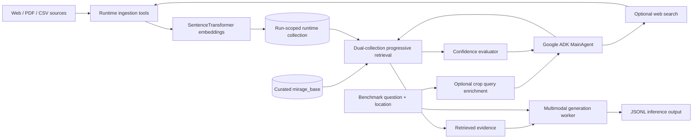
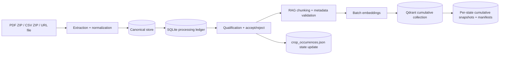
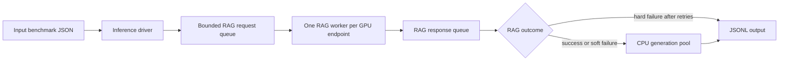

# MIRAGE-RAG Repository Analysis

**Assessment date:** 2026-08-27

## Executive Summary

MIRAGE-RAG is an agricultural, multimodal retrieval-augmented generation system built around the MIRAGE benchmark. It combines:

- Offline and runtime document ingestion.
- Sentence-transformer embeddings and metadata-rich chunks.
- Location-aware retrieval using USDA hardiness-zone metadata.
- An LLM-driven RAG agent with confidence evaluation and optional web augmentation.
- Crop-aware query enrichment.
- Multi-process GPU inference followed by a separate answer-generation stage.
- LLM-as-a-judge evaluation for identification and management-oriented questions.
- Ablation configurations for comparing progressively richer RAG behaviors.

The preload/runtime architecture is now aligned on Qdrant:

- **Qdrant is the active vector store for runtime `rag_agent` paths.**
- **Preload has moved to notebook orchestration** under `preload_pipeline/NEW-ARCHITECTURE/`, with canonical persistence, SQLite processing ledger, batch embedding/upsert, and cumulative per-state Qdrant snapshots.
- The preload pipeline is intentionally decoupled from inference startup and executed as an offline Jupyter workflow.

`Guide.md` is the most current architectural reference for runtime and preload behavior. The checked-in inference path now resolves a run-scoped runtime collection before starting workers and uses rank 0 as a readiness barrier rather than as a collection-reset owner.

The current inference lifecycle is now base/runtime isolated: `mirage_base` is curated and read-only, while each ablation run uses a run-scoped `mirage_runtime_<ablation>_<timestamp>` collection for runtime web/PDF augmentation. The runtime collection is resumed after interruption or cleaned up after successful completion, so runtime ingestion does not contaminate the curated base or a separate run.

## 1. System Purpose and Design Goals

The repository extends MIRAGE benchmark assets into a production-style research pipeline for agricultural questions that may contain text and images. The system is designed to answer questions such as plant identification, disease diagnosis, pest identification, plant care, and management guidance.

The implementation addresses several distinct concerns:

1. **Knowledge preparation:** collect web pages, PDFs, and CSV records; normalize them; chunk them; attach provenance and geographic metadata; and persist embeddings.
2. **Question interpretation:** preserve the original question while optionally adding crop context inferred from a state-organized crop dictionary.
3. **Evidence retrieval:** search the vector store using semantic similarity plus progressively relaxed metadata filters.
4. **Uncertainty handling:** score the retrieved evidence and use low confidence as a trigger for web search and additional ingestion.
5. **Answer generation:** combine the user question with retrieved context and send it to an OpenAI-compatible multimodal model endpoint.
6. **Experimental control:** use ablation IDs to disable or enable progressive filtering, confidence evaluation, web search, domain filtering, and ingestion loops.
7. **Evaluation:** split benchmark samples into identification and management groups and score generated answers with judge models.

The architecture favors batch experimentation and cluster execution over a small interactive service. It has explicit GPU process orchestration, endpoint assignment, retry behavior, output checkpointing, and run reports.

## 2. High-Level Architecture

### 2.1 Current runtime architecture

`InferenceDatabaseManager` owns inference collection lifecycle. It validates the optional read-only `mirage_base` collection and selects or creates the run-scoped runtime collection. `MainAgent` is then the runtime owner of the Qdrant connection for that selected runtime collection: it creates a `QdrantClient` from `QDRANT_URL`, defaults to `http://127.0.0.1:6333`, and composes the base/runtime retriever and runtime-only ingestion tools. The Qdrant server owns persistence; RAG workers communicate with it over HTTP.

### 2.2 Preload architecture

This notebook path runs offline, keeps deterministic state across runs, and supports resume/retry semantics without reprocessing completed units.

## 3. Database and Preload Status

### 3.1 Runtime Qdrant path

The following runtime responsibilities are implemented with Qdrant:

- `rag_agent/main.py`
  - Creates `QdrantClient(url=...)`.
  - Resolves `QDRANT_URL` and optional `QDRANT_API_KEY`.
  - Creates a `QdrantStore`.
  - Ensures the collection exists.
  - Uses the lifecycle-selected runtime collection; inference does not mutate `mirage_base`.
  - Passes the store to retrieval, confidence, web, and PDF tools.
- `rag_agent/utils/qdrant_store.py`
  - Creates collections with an explicit vector size and cosine distance.
  - Creates payload indexes for `hardiness_zone`, `month_year`, `title`, and `content_hash`.
  - Converts arbitrary stable string chunk IDs to deterministic UUIDs using UUID5.
  - Computes embeddings before upsert.
  - Stores document text and metadata in Qdrant payloads.
  - Implements deduplication using a filtered `scroll` query.
  - Performs vector search with Qdrant filters.
  - Converts Qdrant's higher-is-better cosine score into the existing distance convention with `1.0 - score`.
- `rag_agent/utils/ContentUtils.py`
  - Embeds query text explicitly.
  - Translates legacy Chroma-style filter dictionaries into Qdrant filters.
  - Retrieves through the `QdrantStore` interface.
- `rag_agent/tools/web_addition.py` and `pdf_addition.py`
  - Use the Qdrant store for runtime chunk insertion and deduplication.
- `rag_agent/tools/confidence_evaluator.py`
  - Evaluates results returned from the Qdrant-backed retrieval path.
- `rag_agent/test_qdrant_migration.py`
  - Exercises embedding helpers, filter translation, collection lifecycle, upsert, deduplication, and search.

### 3.2 Notebook preload path

The preload path now operates under `preload_pipeline/NEW-ARCHITECTURE/`:

- `MetaMIRAGE_Cumulative_Qdrant_Preload_FIXED_FROM_YOURS.ipynb` orchestrates run configuration, source discovery, extraction, qualification, chunking, embedding, upsert, validation, snapshot, and manifest generation.
- `metamirage_preload_final_architecture_updated.md` defines persistence contracts and run invariants (canonical store, SQLite ledger, global deduplication, terminal states).
- `run.md` defines run order, state sequencing, Qdrant startup, and resume behavior.
- `qdrant_delta_setup_context.md` documents snapshot creation, download, restore, and reuse across sessions.

### 3.3 Practical conclusion

The current architecture uses Qdrant for both runtime retrieval and notebook-driven preload builds, while keeping preload execution decoupled from inference-time orchestration.

## 4. Embeddings, Chunking, and Storage Model

### 4.1 Embeddings

`SentenceTransformerEmbeddingFunction` uses the default model `BAAI/bge-base-en-v1.5` and selects CUDA when available unless a device is explicitly supplied. It supports both batch embedding and single-query embedding and exposes the vector dimension used when Qdrant creates a collection.

Because Qdrant does not own text embedding in this design, the application must compute vectors before both upsert and search. This is correctly handled by `QdrantStore` and `ContentUtils`.

The embedding model and device must be aligned across all producers and consumers. Changing the model without rebuilding or migrating the collection can produce incompatible vector dimensions or semantically inconsistent retrieval.

### 4.2 Chunking

`ContentUtils` uses a Hugging Face tokenizer and enforces a maximum of 512 tokens. The configured PDF and web chunk limits are lower, with overlap to preserve context across boundaries. Chunks are decoded back into text and stored with a formatted title prefix on the runtime ingestion paths.

The notebook preload path uses deterministic chunking and metadata contracts designed to stay compatible with runtime retrieval expectations.

### 4.3 Qdrant point representation

A runtime point contains:

- A deterministic UUID derived from the stable string chunk ID.
- An embedding vector.
- A payload containing `text`, `chunk_id`, and canonical metadata.

Typical metadata includes:

- `source_type`
- `source_id`
- `title`
- `url`
- `page`
- `chunk_index`
- `location`
- `month_year`
- `content_hash`
- `language`
- `hardiness_zone`

`content_hash` supports duplicate avoidance. Payload indexes support filtered retrieval and duplicate checks.

## 5. Metadata and Retrieval

### 5.1 Location-aware metadata

The system treats location as a retrieval signal rather than simply a display field. A location is normalized and passed through hardiness-zone lookup utilities. The resulting `hardiness_zone` can be used with title and month/year filters.

The notebook preload preflight/validation expects that:

- CSV sources provide either a source-level `location` or a row-level `location_field`.
- Web-page-list and PDF-directory sources provide a source-level `location`.

This policy is intended to make location-aware retrieval possible, although a lookup can still fail to produce a hardiness zone for unknown or malformed locations.

### 5.2 Progressive filtering

`ContentUtils.retrieve_with_priority_filters` creates a set of candidate strategies, from more specific metadata combinations to semantic-only retrieval. Candidate filters may include:

- `hardiness_zone + month_year + title`
- `hardiness_zone + title`
- `title`
- `month_year`
- `hardiness_zone + month_year`
- `hardiness_zone`
- `semantic_only`

For each strategy, the code performs a Qdrant search using the same query embedding. A strategy is valid when it returns at least `min_results` results. The selected strategy is the valid strategy with the highest normalized similarity score, not necessarily the first strategy that returned a hit.

This is an important implementation choice: metadata specificity is treated as a candidate constraint, while retrieval quality still determines the winner.

### 5.3 Score compatibility

Qdrant cosine scores are higher for more similar results. The store converts them to `distance = 1.0 - score` so downstream code can continue using the older distance-shaped result contract. Confidence evaluation then converts the distance back into a similarity-like value.

The compatibility layer reduces the amount of downstream code that had to change during migration, but the remaining Chroma naming in functions such as `chroma_where_to_qdrant_filter` and comments can make the current abstraction harder to understand.

## 6. Runtime RAG Agent

`MainAgent` is the central runtime composition root. It initializes:

- The embedding function.
- The Qdrant client and store.
- Content and chunking utilities.
- PDF and web ingestion tools.
- Web search.
- Confidence evaluation.
- Keyword extraction.
- Ablation settings.
- A Google ADK `LlmAgent` wrapped by an `InMemoryRunner`.

The agent's tools are selected from the ablation settings. The normal conceptual flow is:

1. Retrieve content first.
2. Evaluate confidence after retrieval when enabled.
3. If confidence is low, extract search keywords and search the web.
4. Ingest selected web pages or PDFs when enabled.
5. Retrieve again after augmentation.
6. Provide grounded evidence to the answer-generation stage.

The tool wrappers log success and failure and expose structured dictionaries with status and error fields. Web ingestion requires a valid `month_year` in the tracked wrapper, which protects the metadata contract for newly ingested web documents.

### 6.1 Confidence evaluation

`ConfidenceEvaluator` combines four signals:

- Average similarity.
- Evidence coverage, based on result count.
- Similarity consistency, based on variance.
- Retrieval scope, based on the selected metadata strategy.

The weighted score is:

- Similarity: 50%.
- Coverage: 20%.
- Consistency: 20%.
- Scope: 10%.

Scores at or above `0.75` are high confidence, scores from `0.50` to below `0.75` are medium confidence, and lower scores are low confidence.

This is a heuristic confidence model rather than a calibrated probability estimate. It is useful as a routing signal for experiments, but it should not be interpreted as a statistically validated confidence measure without additional calibration work.

### 6.2 Web augmentation

Low-confidence retrieval can lead to web search and ingestion. The system includes location-aware domain filtering, with agricultural and educational sources prioritized when enabled. Newly ingested content is embedded and upserted into the active run-scoped runtime Qdrant collection, while the curated base collection remains read-only.

This makes only the run-scoped runtime database mutable during inference. Runtime knowledge is available to later queries in the same run, but independent runs use a different runtime collection unless explicitly resumed. A successful run may snapshot the runtime collection before cleanup; interrupted runs preserve it for resume.

## 7. Query Enrichment

`rag_agent/crop_query_enrichment.py` is separate from vector storage. It uses a crop dictionary JSON to add crop context when the query implies a crop but does not name one.

The enrichment behavior is designed to be conservative:

- It preserves the location prefix.
- It selects the relevant state slice.
- It calls an OpenAI-compatible model endpoint.
- It accepts only JSON with an `enriched_body` field.
- It rejects rewrites that are not character-level supersets of the original query body.
- It falls back to the original query on missing data, malformed JSON, model errors, or invalid rewrites.

The crop dictionary is therefore not a second vector database and does not replace Qdrant. It is a query-rewriting aid consumed inside each RAG worker before retrieval.

## 8. Batch Inference Architecture

`Inference/generate.py` separates RAG orchestration from final answer generation and manages the Qdrant runtime lifecycle.

The main responsibilities include:

- Reading benchmark JSON and skipping already successful output items.
- Building prompts with optional location context.
- Detecting available GPUs.
- Building OpenAI-compatible endpoints starting at port 11434.
- Starting one RAG process per endpoint.
- Performing optional crop query enrichment inside RAG workers.
- Calling the ADK runner for RAG.
- Combining the effective query with retrieved context.
- Sending the combined prompt and images to the generation client.
- Writing incremental JSONL results.

Before starting workers, the driver uses `InferenceDatabaseManager` to validate `mirage_base` when enabled and select the active runtime collection. It starts rank 0 first, waits for its `READY` status, then starts the remaining per-endpoint workers. All workers receive the same runtime collection name. The bounded request queue controls RAG backpressure; the response queue decouples RAG completion from the independent generation pool.

### 8.1 Failure handling

RAG failures are classified using text heuristics:

- Connection, timeout, HTTP 5xx, and exception-like failures are hard failures and can be retried.
- Short answers and non-hard failures are soft failures; generation continues using the effective query without retrieved context.
- A hard failure after retry is written without running generation.

Generation has its own retry loop and writes `-1` plus an error field when all retries fail.

This layered failure model is useful for long batch jobs because a weak retrieval response does not necessarily prevent answer generation. The main limitations are that classification depends on error-message text and there is no per-request timeout inside the RAG worker itself.

### 8.2 Collection lifecycle

The current startup path does not reset a shared collection from rank 0. Instead, the main process resolves a run-scoped runtime collection before workers start. Rank 0 reports `READY`, then the remaining workers are launched with the same selected collection. The curated `mirage_base` collection is never reset or mutated by inference.

`--runtime_mode resume` selects the newest matching runtime collection for the ablation, while `--runtime_mode fresh` deletes matching runtime collections and creates a new timestamped one. `--runtime_collection_override` can select a specific existing runtime collection in resume mode. On success, `--snapshot_runtime` creates a Qdrant snapshot before the runtime collection is deleted; on failure or interruption, the runtime collection is preserved.

### 8.3 Launch-script drift

`Inference/bash_generate.sh` is a useful example launcher, but its checked-in values currently select `standard_without_rag`, use `--no-rag`, and reference a dataset layout that is not visible in the repository structure shown here. The repository does contain `Datasets/standard` and `Datasets/sample_bench`.

This script should be considered an experiment-specific template rather than a guaranteed current end-to-end command. Its settings do not exercise the full Qdrant-backed RAG path.

## 9. Ablation Framework

Ablation behavior is configured in `rag_agent/ablation_configs.json` and selected by `ABLATION_ID` in the inference launcher. Current named configurations include:

- Static RAG.
- Static RAG plus crop dictionary.
- Progressive RAG.
- Uncertainty-aware RAG.
- Full system without domain filtering.
- Full domain-filtered system.
- Full system without database or crop dictionary.

The toggles control:

- Whether the database path is conceptually enabled.
- Crop dictionary use.
- Progressive filtering.
- Confidence evaluation.
- Web search.
- Domain filtering.
- Ingestion loop behavior.

`MainAgent` applies the runtime toggles and chooses the tool set. It also loads instruction templates from `rag_agent/model_instructions.md`, using a fallback template when an ablation-specific instruction is not found.

The framework provides a stable runtime entrypoint for controlled comparisons. Runtime web content is isolated to the selected run collection, while all runs can share the immutable curated base. Reproducibility still requires recording the ablation ID, runtime mode/collection, Qdrant endpoint, embedding model, and whether runtime snapshotting was enabled.

## 10. Preload Pipeline

The preload subsystem is notebook-orchestrated and provides several useful operational safeguards:

- Input discovery and configuration validation.
- Location metadata validation.
- File locking to avoid concurrent preload writers.
- State-scoped retries and terminal-state validation.
- Global deduplication via canonical content hashing.
- Cumulative per-state Qdrant snapshots and manifests.
- Atomic updates to cumulative `crop_occurrences.json` state sections.

The pipeline is now notebook-driven and offline, with explicit resume behavior through persisted canonical content, SQLite ledger state, and snapshot restore support.

## 11. Evaluation and Benchmarking

### 11.1 Benchmark data and split

`Datasets/` contains standard and sample benchmark assets, images, inference outputs, metadata tables, and evaluation artifacts. `Inference/split.py` joins model outputs back to raw benchmark records and separates samples into:

- Identification categories: plant, insect/pest, and plant disease identification.
- Management categories: plant care, disease management, insect/pest management, and weeds/invasive plant management.

It writes separate JSON files for the two evaluation modes.

### 11.2 LLM-as-a-judge scoring

`Evaluation/LLMsAsJudges_ID.py` evaluates:

- Identification accuracy on a binary scale.
- Reasoning accuracy on a 0-4 scale.

`Evaluation/LLMsAsJudges_MG.py` evaluates:

- Accuracy.
- Relevance.
- Completeness.
- Parsimony.

The evaluation scripts use multiprocessing, a shared lock for append-only JSONL writes, retry up to five times, and output cleanup that removes records with a `-1` score. `Evaluation/print_scores.py` computes means and a weighted management score where accuracy has double the weight of each other management criterion.

The repository contains several result trees for standard, contextual, and confidence-oriented experiments. These are historical or experiment-specific artifacts rather than one canonical score set. Comparing them requires recording the subject model, judge model, benchmark type, ablation configuration, database state, and inference settings.

### 11.3 Evaluation limitations

LLM-as-a-judge scores provide useful comparative evidence but are not equivalent to a deterministic expert annotation protocol. The judge model, prompt, temperature, retries, and output parsing can affect results. The scripts also depend on output file conventions and model-name-derived paths, so experiment bookkeeping is important.

## 12. Documentation Consistency Review

### `Inference/README.md`

The inference README should describe the staged batch flow, base/runtime collection roles, Qdrant server prerequisite, runtime resume/fresh behavior, and crop-dictionary options. Any remaining Chroma-specific language should be treated as historical unless explicitly tied to legacy folders.

### `Guide.md`

Guide should present runtime Qdrant behavior and notebook preload behavior as complementary but operationally separate paths.

It should still be reconciled with the current `generate.py` startup behavior, particularly the rank-0 reset description.

### `MSCdocs/CHROMADB_TO_QDRANT_MIGRATION.md`

This is a detailed migration design and API mapping document. It explains the conceptual differences between Chroma and Qdrant, including explicit embedding, payload storage, point IDs, vector dimensions, filters, and score semantics.

It reads partly like a migration reference. Current runtime code has completed the `rag_agent` migration, and the preload files under `preload_pipeline/NEW-ARCHITECTURE/` document the notebook-driven Qdrant build, canonical persistence, ledger, snapshots, and resume workflow.

### `preload_pipeline/NEW-ARCHITECTURE/*`

The NEW-ARCHITECTURE docs are the primary preload reference for current operations (run order, persistence model, snapshotting, and resume behavior).

### `MSCdocs/Documentation.md` and other notes

These documents preserve valuable design history around queues, worker behavior, and earlier Chroma issues. They should be treated as historical or subsystem-specific references when they conflict with executable code.

## 13. Strengths of the Implementation

- Clear separation between runtime RAG, generation, and evaluation.
- Qdrant server mode is a sensible response to multi-process access and lifecycle issues in distributed inference workloads.
- Deterministic point IDs make runtime upserts repeatable.
- Metadata payload indexes support the location, time, title, and deduplication use cases.
- Progressive retrieval retains semantic-only fallback instead of failing when metadata is incomplete.
- Query enrichment has strict fallback behavior and does not silently replace the original question with arbitrary model output.
- Runtime tools return structured status dictionaries, which simplifies failure routing.
- Ablation controls provide a consistent way to compare system mechanisms.
- Preload includes locking, backups, validation, and run reporting.
- Inference supports checkpoint-style output continuation and separate retry policies for RAG and generation.

## 14. Main Risks and Open Gaps

### High priority

1. **Run bookkeeping remains important.** Runtime collections are isolated, but reproducibility still depends on recording the selected runtime collection and resume/fresh mode.
2. **README preload/runtime wording can drift.** Preload notebook flow and runtime flow must remain clearly separated in documentation.
3. **Runtime snapshots are optional.** A successful run deletes its runtime collection unless `--snapshot_runtime` is enabled, so preserving a completed run requires explicitly requesting a snapshot.

### Medium priority

5. **Preload and runtime operational contracts must stay synchronized.** Metadata schema, chunking assumptions, and collection naming conventions need routine consistency checks.
6. **Documentation and launcher defaults drift from repository contents.** Some scripts reference benchmark directories or modes not present in the visible layout.
7. **Failure handling is heuristic.** Hard/soft classification uses error-message substrings and RAG workers do not have a per-request timeout.
8. **Run reports are aggregate-heavy.** Item failures may be counted without a structured item-level error record.
9. **Score terminology retains migration history.** Legacy naming in filter translation helpers/comments can obscure current ownership.

### Lower priority

10. **Evaluation artifacts lack one canonical experiment manifest.** Results need external context to reconstruct exact model, judge, ablation, database, and endpoint conditions.
11. **The dependency file is named `requirments.txt`.** The spelling is deliberate in existing documentation but remains an avoidable source of installation mistakes.
12. **Some comments and disabled code paths describe older lifecycle assumptions.** They can confuse future maintenance even when they are no longer active.

## 15. Recommended Next Engineering Sequence

This report does not modify the existing implementation. Based on the current state, the lowest-risk engineering sequence would be:

1. Keep `Inference/README.md`, `Guide.md`, and NEW-ARCHITECTURE preload docs synchronized with executable defaults.
2. Add a small integration check that starts or connects to Qdrant, creates the collection, inserts one chunk, filters it, retrieves it, and verifies deduplication.
3. Add a reproducibility manifest containing benchmark path, model endpoints, embedding model, Qdrant URL/collection, ablation ID, and runtime mode.
4. Extend preload reporting validation with clearer per-unit failure categorization and portable path handling.

## 16. Bottom Line

The project architecture now aligns preload and runtime storage around Qdrant, with preload executed through an offline notebook workflow that manages canonical persistence, processing ledger state, and cumulative snapshots.

The most accurate mental model is a Qdrant-centered system with two distinct execution modes: notebook-based offline preload and multi-process runtime RAG/generation inference.

This analysis is based on static inspection of the repository files and existing documentation. No inference job, Qdrant server, preload run, or evaluation run was executed as part of this report.
