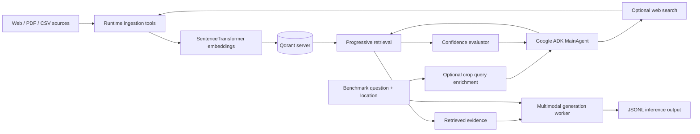
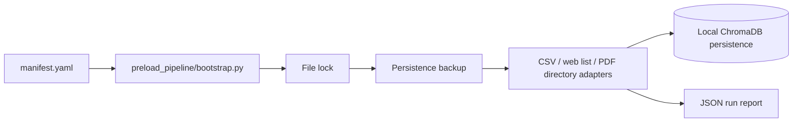
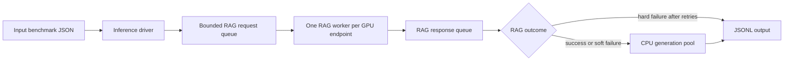

# MIRAGE-RAG Repository Analysis

**Assessment date:** 2026-08-19

## Executive Summary

MIRAGE-RAG is an agricultural, multimodal retrieval-augmented generation system built around the MIRAGE benchmark. It combines:

- Offline and runtime document ingestion.
- Sentence-transformer embeddings and metadata-rich chunks.
- Location-aware retrieval using USDA hardiness-zone metadata.
- An LLM-driven RAG agent with confidence evaluation and optional web augmentation.
- Crop-aware query enrichment.
- Multi-process GPU inference followed by a separate answer-generation stage.
- LLM-as-a-judge evaluation for identification and management-oriented questions.
- Ablation configurations for comparing progressively richer RAG behaviors.

The database migration is **partially complete**:

- **Qdrant is the active vector store for the runtime `rag_agent` path.** `MainAgent`, retrieval, confidence evaluation, runtime web ingestion, and runtime PDF ingestion use `QdrantClient` and `QdrantStore`.
- **The preload pipeline still uses ChromaDB.** It creates a `chromadb.PersistentClient`, writes to a local Chroma persistence directory, and retains Chroma-specific adapters and CLI terminology.
- Therefore, the project is not yet a single-backend Qdrant system. It currently has a Qdrant runtime backend and a separate Chroma preload backend. The existing `README.MD` describes Chroma too broadly and is out of date for the runtime architecture.

`Guide.md` is the most current architectural reference, although it also contains at least one operational mismatch: it describes a rank-0 collection reset that the current `Inference/generate.py` does not appear to enable in its checked-in startup path.

## 1. System Purpose and Design Goals

The repository extends MIRAGE benchmark assets into a production-style research pipeline for agricultural questions that may contain text and images. The system is designed to answer questions such as plant identification, disease diagnosis, pest identification, plant care, and management guidance.

The implementation addresses several distinct concerns:

1. **Knowledge preparation:** collect web pages, PDFs, and CSV records; normalize them; chunk them; attach provenance and geographic metadata; and persist embeddings.
2. **Question interpretation:** preserve the original question while optionally adding crop context inferred from a state-organized crop dictionary.
3. **Evidence retrieval:** search the vector store using semantic similarity plus progressively relaxed metadata filters.
4. **Uncertainty handling:** score the retrieved evidence and use low confidence as a trigger for web search and additional ingestion.
5. **Answer generation:** combine the user question with retrieved context and send it to an OpenAI-compatible multimodal model endpoint.
6. **Experimental control:** use ablation IDs to disable or enable progressive filtering, confidence evaluation, web search, domain filtering, and ingestion loops.
7. **Evaluation:** split benchmark samples into identification and management groups and score generated answers with judge models.

The architecture favors batch experimentation and cluster execution over a small interactive service. It has explicit GPU process orchestration, endpoint assignment, retry behavior, output checkpointing, and run reports.

## 2. High-Level Architecture

### 2.1 Current runtime architecture

`MainAgent` is the runtime owner of the Qdrant connection. It creates a `QdrantClient` from `QDRANT_URL`, defaults to `http://127.0.0.1:6333`, and uses the `meta-mirage_collection` collection name. The Qdrant server owns persistence; RAG workers communicate with it over HTTP.

### 2.2 Preload architecture

This is a separate implementation path. `preload_pipeline/preload/rag_agent_integration.py` imports `chromadb`, creates a `PersistentClient`, and constructs a Chroma collection. `preload_pipeline/preload/pipeline/chunk_upsert.py` also defines a standalone `ChromaUpserter`.

The preload output is not automatically a Qdrant collection. A Chroma directory cannot be passed to the current runtime `MainAgent`, which expects a reachable Qdrant server and collection.

## 3. Database Migration Status

### 3.1 What has migrated to Qdrant

The following runtime responsibilities are implemented with Qdrant:

- `rag_agent/main.py`
  - Creates `QdrantClient(url=...)`.
  - Resolves `QDRANT_URL` and optional `QDRANT_API_KEY`.
  - Creates a `QdrantStore`.
  - Ensures the collection exists.
  - Resets or reloads the remote collection through Qdrant APIs.
  - Passes the store to retrieval, confidence, web, and PDF tools.
- `rag_agent/utils/qdrant_store.py`
  - Creates collections with an explicit vector size and cosine distance.
  - Creates payload indexes for `hardiness_zone`, `month_year`, `title`, and `content_hash`.
  - Converts arbitrary stable string chunk IDs to deterministic UUIDs using UUID5.
  - Computes embeddings before upsert.
  - Stores document text and metadata in Qdrant payloads.
  - Implements deduplication using a filtered `scroll` query.
  - Performs vector search with Qdrant filters.
  - Converts Qdrant's higher-is-better cosine score into the existing distance convention with `1.0 - score`.
- `rag_agent/utils/ContentUtils.py`
  - Embeds query text explicitly.
  - Translates legacy Chroma-style filter dictionaries into Qdrant filters.
  - Retrieves through the `QdrantStore` interface.
- `rag_agent/tools/web_addition.py` and `pdf_addition.py`
  - Use the Qdrant store for runtime chunk insertion and deduplication.
- `rag_agent/tools/confidence_evaluator.py`
  - Evaluates results returned from the Qdrant-backed retrieval path.
- `rag_agent/test_qdrant_migration.py`
  - Exercises embedding helpers, filter translation, collection lifecycle, upsert, deduplication, and search.

### 3.2 What remains Chroma-specific

The following preload components still use ChromaDB directly:

- `preload_pipeline/bootstrap.py` uses Chroma terminology in its `--persist-dir`, `--collection`, and `--dry-run` help text.
- `preload_pipeline/preload/pipeline/chunk_upsert.py` imports `chromadb` and writes through `PersistentClient` and `collection.upsert`.
- `preload_pipeline/preload/rag_agent_integration.py` imports `chromadb`, creates the persistent collection, and exposes a Chroma-shaped interface to the adapters.
- `preload_pipeline/docs/README.md` describes the preload output as a compatible Chroma database for the RAG agent. That statement is no longer correct for the current Qdrant runtime unless a separate migration/import step is performed.
- Existing preload artifacts and logs use paths such as `chroma_database_src/chroma_db`.

The migration guide in `MSCdocs/CHROMADB_TO_QDRANT_MIGRATION.md` is useful as a design reference, but its opening inventory describes the pre-migration state and should not be read as a current inventory of all runtime code.

### 3.3 Practical conclusion

The accurate description is:

> Qdrant is the current runtime vector backend, while the manifest-driven preload pipeline remains ChromaDB-based and has not yet been integrated with the Qdrant server.

This distinction is the most important README correction. A user following the current README may believe that preload and runtime share the same Chroma persistence directory, which is not true in the current implementation.

## 4. Embeddings, Chunking, and Storage Model

### 4.1 Embeddings

`SentenceTransformerEmbeddingFunction` uses the default model `BAAI/bge-base-en-v1.5` and selects CUDA when available unless a device is explicitly supplied. It supports both batch embedding and single-query embedding and exposes the vector dimension used when Qdrant creates a collection.

Because Qdrant does not own text embedding in this design, the application must compute vectors before both upsert and search. This is correctly handled by `QdrantStore` and `ContentUtils`.

The embedding model and device must be aligned across all producers and consumers. Changing the model without rebuilding or migrating the collection can produce incompatible vector dimensions or semantically inconsistent retrieval.

### 4.2 Chunking

`ContentUtils` uses a Hugging Face tokenizer and enforces a maximum of 512 tokens. The configured PDF and web chunk limits are lower, with overlap to preserve context across boundaries. Chunks are decoded back into text and stored with a formatted title prefix on the runtime ingestion paths.

The preload pipeline also delegates important work to runtime ingestion utilities in some paths, but it retains additional standalone Chroma ingestion code. This increases the risk of behavior divergence between preload and runtime chunking, embedding, and metadata handling.

### 4.3 Qdrant point representation

A runtime point contains:

- A deterministic UUID derived from the stable string chunk ID.
- An embedding vector.
- A payload containing `text`, `chunk_id`, and canonical metadata.

Typical metadata includes:

- `source_type`
- `source_id`
- `title`
- `url`
- `page`
- `chunk_index`
- `location`
- `month_year`
- `content_hash`
- `language`
- `hardiness_zone`

`content_hash` supports duplicate avoidance. Payload indexes support filtered retrieval and duplicate checks.

## 5. Metadata and Retrieval

### 5.1 Location-aware metadata

The system treats location as a retrieval signal rather than simply a display field. A location is normalized and passed through hardiness-zone lookup utilities. The resulting `hardiness_zone` can be used with title and month/year filters.

The preload manifest validates that:

- CSV sources provide either a source-level `location` or a row-level `location_field`.
- Web-page-list and PDF-directory sources provide a source-level `location`.

This policy is intended to make location-aware retrieval possible, although a lookup can still fail to produce a hardiness zone for unknown or malformed locations.

### 5.2 Progressive filtering

`ContentUtils.retrieve_with_priority_filters` creates a set of candidate strategies, from more specific metadata combinations to semantic-only retrieval. Candidate filters may include:

- `hardiness_zone + month_year + title`
- `hardiness_zone + title`
- `title`
- `month_year`
- `hardiness_zone + month_year`
- `hardiness_zone`
- `semantic_only`

For each strategy, the code performs a Qdrant search using the same query embedding. A strategy is valid when it returns at least `min_results` results. The selected strategy is the valid strategy with the highest normalized similarity score, not necessarily the first strategy that returned a hit.

This is an important implementation choice: metadata specificity is treated as a candidate constraint, while retrieval quality still determines the winner.

### 5.3 Score compatibility

Qdrant cosine scores are higher for more similar results. The store converts them to `distance = 1.0 - score` so downstream code can continue using the older distance-shaped result contract. Confidence evaluation then converts the distance back into a similarity-like value.

The compatibility layer reduces the amount of downstream code that had to change during migration, but the remaining Chroma naming in functions such as `chroma_where_to_qdrant_filter` and comments can make the current abstraction harder to understand.

## 6. Runtime RAG Agent

`MainAgent` is the central runtime composition root. It initializes:

- The embedding function.
- The Qdrant client and store.
- Content and chunking utilities.
- PDF and web ingestion tools.
- Web search.
- Confidence evaluation.
- Keyword extraction.
- Ablation settings.
- A Google ADK `LlmAgent` wrapped by an `InMemoryRunner`.

The agent's tools are selected from the ablation settings. The normal conceptual flow is:

1. Retrieve content first.
2. Evaluate confidence after retrieval when enabled.
3. If confidence is low, extract search keywords and search the web.
4. Ingest selected web pages or PDFs when enabled.
5. Retrieve again after augmentation.
6. Provide grounded evidence to the answer-generation stage.

The tool wrappers log success and failure and expose structured dictionaries with status and error fields. Web ingestion requires a valid `month_year` in the tracked wrapper, which protects the metadata contract for newly ingested web documents.

### 6.1 Confidence evaluation

`ConfidenceEvaluator` combines four signals:

- Average similarity.
- Evidence coverage, based on result count.
- Similarity consistency, based on variance.
- Retrieval scope, based on the selected metadata strategy.

The weighted score is:

- Similarity: 50%.
- Coverage: 20%.
- Consistency: 20%.
- Scope: 10%.

Scores at or above `0.75` are high confidence, scores from `0.50` to below `0.75` are medium confidence, and lower scores are low confidence.

This is a heuristic confidence model rather than a calibrated probability estimate. It is useful as a routing signal for experiments, but it should not be interpreted as a statistically validated confidence measure without additional calibration work.

### 6.2 Web augmentation

Low-confidence retrieval can lead to web search and ingestion. The system includes location-aware domain filtering, with agricultural and educational sources prioritized when enabled. Newly ingested content is embedded and upserted into the same Qdrant collection used by retrieval.

This makes the runtime database mutable during inference. It is a deliberate design for knowledge expansion, but it also means experiment reproducibility depends on collection reset, collection snapshotting, or a controlled starting collection.

## 7. Query Enrichment

`rag_agent/crop_query_enrichment.py` is separate from vector storage. It uses a crop dictionary JSON to add crop context when the query implies a crop but does not name one.

The enrichment behavior is designed to be conservative:

- It preserves the location prefix.
- It selects the relevant state slice.
- It calls an OpenAI-compatible model endpoint.
- It accepts only JSON with an `enriched_body` field.
- It rejects rewrites that are not character-level supersets of the original query body.
- It falls back to the original query on missing data, malformed JSON, model errors, or invalid rewrites.

The crop dictionary is therefore not a second vector database and does not replace Qdrant. It is a query-rewriting aid consumed inside each RAG worker before retrieval.

## 8. Batch Inference Architecture

`Inference/generate.py` separates RAG orchestration from final answer generation.

The main responsibilities include:

- Reading benchmark JSON and skipping already successful output items.
- Building prompts with optional location context.
- Detecting available GPUs.
- Building OpenAI-compatible endpoints starting at port 11434.
- Starting one RAG process per endpoint.
- Performing optional crop query enrichment inside RAG workers.
- Calling the ADK runner for RAG.
- Combining the effective query with retrieved context.
- Sending the combined prompt and images to the generation client.
- Writing incremental JSONL results.

### 8.1 Failure handling

RAG failures are classified using text heuristics:

- Connection, timeout, HTTP 5xx, and exception-like failures are hard failures and can be retried.
- Short answers and non-hard failures are soft failures; generation continues using the effective query without retrieved context.
- A hard failure after retry is written without running generation.

Generation has its own retry loop and writes `-1` plus an error field when all retries fail.

This layered failure model is useful for long batch jobs because a weak retrieval response does not necessarily prevent answer generation. The main limitations are that classification depends on error-message text and there is no per-request timeout inside the RAG worker itself.

### 8.2 Collection reset discrepancy

The design documentation describes rank 0 resetting the Qdrant collection before other workers begin. The worker function supports a `do_reset_collection` flag and `MainAgent.reset_collection()` is implemented.

However, the checked-in startup path in `generate.py` currently passes `do_reset_collection=False` when creating workers. Consequently, the documented reset behavior should be treated as an intended or historical operational model, not as verified current behavior. This matters because runtime web ingestion can make successive experiments share state unless the collection is reset externally or the startup path is corrected.

### 8.3 Launch-script drift

`Inference/bash_generate.sh` is a useful example launcher, but its checked-in values currently select `standard_without_rag`, use `--no-rag`, and reference a dataset layout that is not visible in the repository structure shown here. The repository does contain `Datasets/standard` and `Datasets/sample_bench`.

This script should be considered an experiment-specific template rather than a guaranteed current end-to-end command. Its settings do not exercise the full Qdrant-backed RAG path.

## 9. Ablation Framework

Ablation behavior is configured in `rag_agent/ablation_configs.json` and selected by `ABLATION_ID` in the inference launcher. Current named configurations include:

- Static RAG.
- Static RAG plus crop dictionary.
- Progressive RAG.
- Uncertainty-aware RAG.
- Full system without domain filtering.
- Full domain-filtered system.
- Full system without database or crop dictionary.

The toggles control:

- Whether the database path is conceptually enabled.
- Crop dictionary use.
- Progressive filtering.
- Confidence evaluation.
- Web search.
- Domain filtering.
- Ingestion loop behavior.

`MainAgent` applies the runtime toggles and chooses the tool set. It also loads instruction templates from `rag_agent/model_instructions.md`, using a fallback template when an ablation-specific instruction is not found.

The framework provides a stable runtime entrypoint for controlled comparisons. The main reproducibility concern is mutable Qdrant state: full-system experiments that ingest web content can influence later runs unless each run starts from a known collection state.

## 10. Preload Pipeline

The preload subsystem is manifest-driven and provides several useful operational safeguards:

- Manifest schema validation.
- Location metadata validation.
- File locking to avoid concurrent preload writers.
- Persistence-directory backups before write-heavy operations.
- CSV, web-page-list, and recursive PDF-directory adapters.
- Aggregate JSON run reports.
- Dry-run support.

The adapters are relatively thin and delegate ingestion to shared or related RAG utilities. CSV ingestion processes rows and tracks added, skipped, and failed counts. Web and PDF adapters call runtime-style ingestion tools.

The architectural problem is backend ownership: the integration layer still supplies Chroma collections to tools whose current runtime versions expect `QdrantStore`. This creates an explicit migration boundary that has not been resolved. The preload documentation therefore describes a subsystem that may work independently, but it does not currently describe a complete path into the active Qdrant collection.

An existing preload report also contains machine-specific paths and aggregate failure counters without corresponding item-level error entries. The reporting format is useful for run summaries but should not be treated as a complete audit log.

## 11. Evaluation and Benchmarking

### 11.1 Benchmark data and split

`Datasets/` contains standard and sample benchmark assets, images, inference outputs, metadata tables, and evaluation artifacts. `Inference/split.py` joins model outputs back to raw benchmark records and separates samples into:

- Identification categories: plant, insect/pest, and plant disease identification.
- Management categories: plant care, disease management, insect/pest management, and weeds/invasive plant management.

It writes separate JSON files for the two evaluation modes.

### 11.2 LLM-as-a-judge scoring

`Evaluation/LLMsAsJudges_ID.py` evaluates:

- Identification accuracy on a binary scale.
- Reasoning accuracy on a 0-4 scale.

`Evaluation/LLMsAsJudges_MG.py` evaluates:

- Accuracy.
- Relevance.
- Completeness.
- Parsimony.

The evaluation scripts use multiprocessing, a shared lock for append-only JSONL writes, retry up to five times, and output cleanup that removes records with a `-1` score. `Evaluation/print_scores.py` computes means and a weighted management score where accuracy has double the weight of each other management criterion.

The repository contains several result trees for standard, contextual, and confidence-oriented experiments. These are historical or experiment-specific artifacts rather than one canonical score set. Comparing them requires recording the subject model, judge model, benchmark type, ablation configuration, database state, and inference settings.

### 11.3 Evaluation limitations

LLM-as-a-judge scores provide useful comparative evidence but are not equivalent to a deterministic expert annotation protocol. The judge model, prompt, temperature, retries, and output parsing can affect results. The scripts also depend on output file conventions and model-name-derived paths, so experiment bookkeeping is important.

## 12. Documentation Consistency Review

### `README.MD`

The README is a good high-level starting point, but it is stale in the most important architectural section. It says offline preload writes to persistent Chroma, presents Chroma as the central database in diagrams, and says runtime web augmentation writes back to Chroma. The runtime code now writes to Qdrant.

Its setup sanity check imports `chromadb`, while the current runtime dependency list includes `qdrant-client`. The preload-specific Chroma statements are still relevant, but they need to be scoped explicitly to preload rather than presented as the whole system.

### `Guide.md`

This is the strongest current reference for the Qdrant runtime, server startup, metadata strategy, retrieval scoring, and batch architecture. It explicitly documents the split between Qdrant runtime storage and Chroma preload storage.

It should still be reconciled with the current `generate.py` startup behavior, particularly the rank-0 reset description.

### `MSCdocs/CHROMADB_TO_QDRANT_MIGRATION.md`

This is a detailed migration design and API mapping document. It explains the conceptual differences between Chroma and Qdrant, including explicit embedding, payload storage, point IDs, vector dimensions, filters, and score semantics.

It reads partly like a pre-implementation plan. Current runtime code has completed much of the `rag_agent` migration, but preload files remain in the older state.

### `preload_pipeline/docs/README.md`

This document is internally consistent for a Chroma-based preload subsystem, but its claim that preload produces the database used directly by `rag_agent` conflicts with the current Qdrant runtime architecture.

### `MSCdocs/Documentation.md` and other notes

These documents preserve valuable design history around queues, worker behavior, and earlier Chroma issues. They should be treated as historical or subsystem-specific references when they conflict with executable code.

## 13. Strengths of the Implementation

- Clear separation between runtime RAG, generation, and evaluation.
- Qdrant server mode is a sensible response to multi-process access problems with a shared local Chroma directory.
- Deterministic point IDs make runtime upserts repeatable.
- Metadata payload indexes support the location, time, title, and deduplication use cases.
- Progressive retrieval retains semantic-only fallback instead of failing when metadata is incomplete.
- Query enrichment has strict fallback behavior and does not silently replace the original question with arbitrary model output.
- Runtime tools return structured status dictionaries, which simplifies failure routing.
- Ablation controls provide a consistent way to compare system mechanisms.
- Preload includes locking, backups, validation, and run reporting.
- Inference supports checkpoint-style output continuation and separate retry policies for RAG and generation.

## 14. Main Risks and Open Gaps

### High priority

1. **Backend split is not fully integrated.** Chroma preload output does not directly populate the Qdrant collection used by runtime retrieval.
2. **Collection lifecycle behavior is ambiguous.** The reset method exists and documentation describes it, but the current inference startup path appears to disable it for all workers.
3. **README architecture is misleading.** It identifies Chroma as the active system-wide database and gives commands that do not match the Qdrant runtime.
4. **Experiment state can leak.** Runtime web ingestion mutates the shared Qdrant collection, so reproducibility depends on collection reset or snapshots.

### Medium priority

5. **Preload and runtime APIs have divergent abstractions.** Chroma-shaped collection methods remain alongside `QdrantStore`, increasing maintenance and migration risk.
6. **Documentation and launcher defaults drift from repository contents.** Some scripts reference benchmark directories or modes not present in the visible layout.
7. **Failure handling is heuristic.** Hard/soft classification uses error-message substrings and RAG workers do not have a per-request timeout.
8. **Run reports are aggregate-heavy.** Item failures may be counted without a structured item-level error record.
9. **Score terminology retains migration history.** Chroma naming remains in Qdrant filter translation helpers and comments, which can obscure current ownership.

### Lower priority

10. **Evaluation artifacts lack one canonical experiment manifest.** Results need external context to reconstruct exact model, judge, ablation, database, and endpoint conditions.
11. **The dependency file is named `requirments.txt`.** The spelling is deliberate in existing documentation but remains an avoidable source of installation mistakes.
12. **Some comments and disabled code paths describe the old local-Chroma lifecycle.** They can confuse future maintenance even when they are no longer active.

## 15. Recommended Next Engineering Sequence

This report does not modify the existing implementation. Based on the current state, the lowest-risk engineering sequence would be:

1. Decide whether Qdrant is the sole intended backend.
2. If yes, replace or isolate the Chroma preload integration behind a Qdrant-backed preload adapter that uses the same embedding, metadata, dedupe, and chunk contracts as runtime ingestion.
3. Define an explicit data migration/import procedure for existing Chroma persistence directories.
4. Make collection lifecycle policy explicit in inference: reset, reuse, or select a named run collection.
5. Reconcile `README.MD`, preload documentation, and `Guide.md` with executable defaults.
6. Add a small integration check that starts or connects to Qdrant, creates the collection, inserts one chunk, filters it, retrieves it, and verifies deduplication.
7. Add a reproducibility manifest containing benchmark path, model endpoints, embedding model, Qdrant URL/collection, ablation ID, and collection reset state.
8. Improve preload reports with per-item structured error records and machine-independent paths where appropriate.

## 16. Bottom Line

The project has made a meaningful migration from ChromaDB to Qdrant, but only the runtime RAG subsystem has completed that transition. The active architecture is now Qdrant server mode plus in-process embeddings, while the offline preload pipeline remains Chroma-based.

The README should therefore not be described as merely slightly outdated. Its central database diagram and several operational commands describe the old or partial architecture. The most accurate current mental model is a two-backend transitional system with a Qdrant runtime, a Chroma preload path, a crop-dictionary enrichment sidecar, and a multi-process RAG-to-generation batch pipeline.

This analysis is based on static inspection of the repository files and existing documentation. No inference job, Qdrant server, preload run, or evaluation run was executed as part of this report.
